# Encounter merge: FireRed / LeafGreen rate differences

_85 areas with rate changes (preserve exclusives). Columns are % chance within that field/rod._
_Each area is collapsible — click a name to expand it._

<h2 style="display:inline-block;margin:0;vertical-align:middle">CeladonCity</h2>

<b>water</b>

<table align="center">
<tr><th align="left">Pokemon</th><th align="right">FireRed</th><th align="right">LeafGreen</th><th align="right">Merged</th></tr>
<tr><td align="left">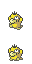 Psyduck</td><td align="right">99.0%</td><td align="right">0.0%</td><td align="right">49.5%</td></tr>
<tr><td align="left">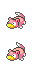 Slowpoke</td><td align="right">0.0%</td><td align="right">99.0%</td><td align="right">49.5%</td></tr>
</table>

<h2 style="display:inline-block;margin:0;vertical-align:middle">CeruleanCave1F</h2>

<b>water</b>

<table align="center">
<tr><th align="left">Pokemon</th><th align="right">FireRed</th><th align="right">LeafGreen</th><th align="right">Merged</th></tr>
<tr><td align="left"> Psyduck</td><td align="right">65.0%</td><td align="right">0.0%</td><td align="right">32.0%</td></tr>
<tr><td align="left"> Slowpoke</td><td align="right">0.0%</td><td align="right">65.0%</td><td align="right">32.0%</td></tr>
<tr><td align="left">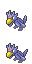 Golduck</td><td align="right">35.0%</td><td align="right">0.0%</td><td align="right">18.0%</td></tr>
<tr><td align="left">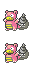 Slowbro</td><td align="right">0.0%</td><td align="right">35.0%</td><td align="right">18.0%</td></tr>
</table>

<b>fishing / super_rod</b>

<table align="center">
<tr><th align="left">Pokemon</th><th align="right">FireRed</th><th align="right">LeafGreen</th><th align="right">Merged</th></tr>
<tr><td align="left">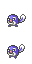 Poliwag</td><td align="right">40.0%</td><td align="right">40.0%</td><td align="right">38.0%</td></tr>
<tr><td align="left">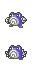 Poliwhirl</td><td align="right">40.0%</td><td align="right">40.0%</td><td align="right">38.0%</td></tr>
<tr><td align="left">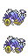 Gyarados</td><td align="right">15.0%</td><td align="right">15.0%</td><td align="right">14.0%</td></tr>
<tr><td align="left"> Psyduck</td><td align="right">5.0%</td><td align="right">0.0%</td><td align="right">5.0%</td></tr>
<tr><td align="left"> Slowpoke</td><td align="right">0.0%</td><td align="right">5.0%</td><td align="right">5.0%</td></tr>
</table>

<h2 style="display:inline-block;margin:0;vertical-align:middle">CeruleanCaveB1F</h2>

<b>water</b>

<table align="center">
<tr><th align="left">Pokemon</th><th align="right">FireRed</th><th align="right">LeafGreen</th><th align="right">Merged</th></tr>
<tr><td align="left"> Psyduck</td><td align="right">65.0%</td><td align="right">0.0%</td><td align="right">32.0%</td></tr>
<tr><td align="left"> Slowpoke</td><td align="right">0.0%</td><td align="right">65.0%</td><td align="right">32.0%</td></tr>
<tr><td align="left"> Golduck</td><td align="right">35.0%</td><td align="right">0.0%</td><td align="right">18.0%</td></tr>
<tr><td align="left"> Slowbro</td><td align="right">0.0%</td><td align="right">35.0%</td><td align="right">18.0%</td></tr>
</table>

<b>fishing / super_rod</b>

<table align="center">
<tr><th align="left">Pokemon</th><th align="right">FireRed</th><th align="right">LeafGreen</th><th align="right">Merged</th></tr>
<tr><td align="left"> Poliwag</td><td align="right">40.0%</td><td align="right">40.0%</td><td align="right">38.4%</td></tr>
<tr><td align="left"> Poliwhirl</td><td align="right">40.0%</td><td align="right">40.0%</td><td align="right">38.4%</td></tr>
<tr><td align="left"> Gyarados</td><td align="right">16.0%</td><td align="right">16.0%</td><td align="right">15.2%</td></tr>
<tr><td align="left"> Psyduck</td><td align="right">4.0%</td><td align="right">0.0%</td><td align="right">4.0%</td></tr>
<tr><td align="left"> Slowpoke</td><td align="right">0.0%</td><td align="right">4.0%</td><td align="right">4.0%</td></tr>
</table>

<h2 style="display:inline-block;margin:0;vertical-align:middle">CeruleanCity</h2>

<b>fishing / good_rod</b>

<table align="center">
<tr><th align="left">Pokemon</th><th align="right">FireRed</th><th align="right">LeafGreen</th><th align="right">Merged</th></tr>
<tr><td align="left">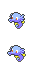 Horsea</td><td align="right">60.0%</td><td align="right">20.0%</td><td align="right">40.0%</td></tr>
<tr><td align="left">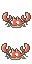 Krabby</td><td align="right">20.0%</td><td align="right">60.0%</td><td align="right">40.0%</td></tr>
</table>

<b>fishing / super_rod</b>

<table align="center">
<tr><th align="left">Pokemon</th><th align="right">FireRed</th><th align="right">LeafGreen</th><th align="right">Merged</th></tr>
<tr><td align="left"> Horsea</td><td align="right">84.0%</td><td align="right">0.0%</td><td align="right">41.6%</td></tr>
<tr><td align="left"> Krabby</td><td align="right">0.0%</td><td align="right">84.0%</td><td align="right">41.6%</td></tr>
<tr><td align="left"> Gyarados</td><td align="right">15.0%</td><td align="right">15.0%</td><td align="right">14.9%</td></tr>
<tr><td align="left"> Psyduck</td><td align="right">1.0%</td><td align="right">0.0%</td><td align="right">1.0%</td></tr>
<tr><td align="left"> Slowpoke</td><td align="right">0.0%</td><td align="right">1.0%</td><td align="right">1.0%</td></tr>
</table>

<h2 style="display:inline-block;margin:0;vertical-align:middle">CinnabarIsland</h2>

<b>fishing / good_rod</b>

<table align="center">
<tr><th align="left">Pokemon</th><th align="right">FireRed</th><th align="right">LeafGreen</th><th align="right">Merged</th></tr>
<tr><td align="left"> Horsea</td><td align="right">60.0%</td><td align="right">20.0%</td><td align="right">40.0%</td></tr>
<tr><td align="left"> Krabby</td><td align="right">20.0%</td><td align="right">60.0%</td><td align="right">40.0%</td></tr>
</table>

<b>fishing / super_rod</b>

<table align="center">
<tr><th align="left">Pokemon</th><th align="right">FireRed</th><th align="right">LeafGreen</th><th align="right">Merged</th></tr>
<tr><td align="left"> Horsea</td><td align="right">40.0%</td><td align="right">0.0%</td><td align="right">19.8%</td></tr>
<tr><td align="left"> Krabby</td><td align="right">0.0%</td><td align="right">40.0%</td><td align="right">19.8%</td></tr>
<tr><td align="left">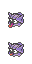 Shellder</td><td align="right">40.0%</td><td align="right">0.0%</td><td align="right">19.8%</td></tr>
<tr><td align="left">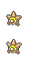 Staryu</td><td align="right">0.0%</td><td align="right">40.0%</td><td align="right">19.8%</td></tr>
<tr><td align="left"> Gyarados</td><td align="right">15.0%</td><td align="right">15.0%</td><td align="right">14.9%</td></tr>
<tr><td align="left">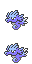 Seadra</td><td align="right">4.0%</td><td align="right">0.0%</td><td align="right">2.0%</td></tr>
<tr><td align="left"> Slowbro</td><td align="right">0.0%</td><td align="right">4.0%</td><td align="right">2.0%</td></tr>
<tr><td align="left"> Psyduck</td><td align="right">1.0%</td><td align="right">0.0%</td><td align="right">1.0%</td></tr>
<tr><td align="left"> Slowpoke</td><td align="right">0.0%</td><td align="right">1.0%</td><td align="right">1.0%</td></tr>
</table>

<h2 style="display:inline-block;margin:0;vertical-align:middle">FiveIsland</h2>

<b>fishing / good_rod</b>

<table align="center">
<tr><th align="left">Pokemon</th><th align="right">FireRed</th><th align="right">LeafGreen</th><th align="right">Merged</th></tr>
<tr><td align="left"> Horsea</td><td align="right">80.0%</td><td align="right">0.0%</td><td align="right">40.0%</td></tr>
<tr><td align="left"> Krabby</td><td align="right">0.0%</td><td align="right">80.0%</td><td align="right">40.0%</td></tr>
</table>

<b>fishing / super_rod</b>

<table align="center">
<tr><th align="left">Pokemon</th><th align="right">FireRed</th><th align="right">LeafGreen</th><th align="right">Merged</th></tr>
<tr><td align="left"> Horsea</td><td align="right">40.0%</td><td align="right">0.0%</td><td align="right">19.8%</td></tr>
<tr><td align="left"> Krabby</td><td align="right">0.0%</td><td align="right">40.0%</td><td align="right">19.8%</td></tr>
<tr><td align="left"> Shellder</td><td align="right">40.0%</td><td align="right">0.0%</td><td align="right">19.8%</td></tr>
<tr><td align="left"> Staryu</td><td align="right">0.0%</td><td align="right">40.0%</td><td align="right">19.8%</td></tr>
<tr><td align="left"> Gyarados</td><td align="right">15.0%</td><td align="right">15.0%</td><td align="right">14.9%</td></tr>
<tr><td align="left">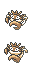 Kingler</td><td align="right">0.0%</td><td align="right">4.0%</td><td align="right">2.0%</td></tr>
<tr><td align="left"> Seadra</td><td align="right">4.0%</td><td align="right">0.0%</td><td align="right">2.0%</td></tr>
<tr><td align="left"> Psyduck</td><td align="right">1.0%</td><td align="right">0.0%</td><td align="right">1.0%</td></tr>
<tr><td align="left"> Slowpoke</td><td align="right">0.0%</td><td align="right">1.0%</td><td align="right">1.0%</td></tr>
</table>

<h2 style="display:inline-block;margin:0;vertical-align:middle">FiveIslandLostCaveRoom1</h2>

<b>land</b>

<table align="center">
<tr><th align="left">Pokemon</th><th align="right">FireRed</th><th align="right">LeafGreen</th><th align="right">Merged</th></tr>
<tr><td align="left">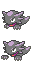 Haunter</td><td align="right">30.0%</td><td align="right">30.0%</td><td align="right">28.0%</td></tr>
<tr><td align="left">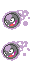 Gastly</td><td align="right">25.0%</td><td align="right">25.0%</td><td align="right">24.0%</td></tr>
<tr><td align="left">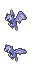 Golbat</td><td align="right">20.0%</td><td align="right">20.0%</td><td align="right">19.0%</td></tr>
<tr><td align="left">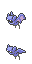 Zubat</td><td align="right">20.0%</td><td align="right">20.0%</td><td align="right">19.0%</td></tr>
<tr><td align="left">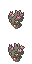 Misdreavus</td><td align="right">0.0%</td><td align="right">5.0%</td><td align="right">5.0%</td></tr>
<tr><td align="left">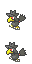 Murkrow</td><td align="right">5.0%</td><td align="right">0.0%</td><td align="right">5.0%</td></tr>
</table>

<h2 style="display:inline-block;margin:0;vertical-align:middle">FiveIslandLostCaveRoom10</h2>

<b>land</b>

<table align="center">
<tr><th align="left">Pokemon</th><th align="right">FireRed</th><th align="right">LeafGreen</th><th align="right">Merged</th></tr>
<tr><td align="left"> Haunter</td><td align="right">30.0%</td><td align="right">30.0%</td><td align="right">28.0%</td></tr>
<tr><td align="left"> Gastly</td><td align="right">25.0%</td><td align="right">25.0%</td><td align="right">24.0%</td></tr>
<tr><td align="left"> Golbat</td><td align="right">20.0%</td><td align="right">20.0%</td><td align="right">19.0%</td></tr>
<tr><td align="left"> Zubat</td><td align="right">20.0%</td><td align="right">20.0%</td><td align="right">19.0%</td></tr>
<tr><td align="left"> Misdreavus</td><td align="right">0.0%</td><td align="right">5.0%</td><td align="right">5.0%</td></tr>
<tr><td align="left"> Murkrow</td><td align="right">5.0%</td><td align="right">0.0%</td><td align="right">5.0%</td></tr>
</table>

<h2 style="display:inline-block;margin:0;vertical-align:middle">FiveIslandLostCaveRoom11</h2>

<b>land</b>

<table align="center">
<tr><th align="left">Pokemon</th><th align="right">FireRed</th><th align="right">LeafGreen</th><th align="right">Merged</th></tr>
<tr><td align="left"> Haunter</td><td align="right">30.0%</td><td align="right">30.0%</td><td align="right">22.0%</td></tr>
<tr><td align="left"> Misdreavus</td><td align="right">0.0%</td><td align="right">20.0%</td><td align="right">20.0%</td></tr>
<tr><td align="left"> Murkrow</td><td align="right">20.0%</td><td align="right">0.0%</td><td align="right">20.0%</td></tr>
<tr><td align="left"> Gastly</td><td align="right">20.0%</td><td align="right">20.0%</td><td align="right">15.0%</td></tr>
<tr><td align="left"> Zubat</td><td align="right">20.0%</td><td align="right">20.0%</td><td align="right">15.0%</td></tr>
<tr><td align="left"> Golbat</td><td align="right">10.0%</td><td align="right">10.0%</td><td align="right">8.0%</td></tr>
</table>

<h2 style="display:inline-block;margin:0;vertical-align:middle">FiveIslandLostCaveRoom12</h2>

<b>land</b>

<table align="center">
<tr><th align="left">Pokemon</th><th align="right">FireRed</th><th align="right">LeafGreen</th><th align="right">Merged</th></tr>
<tr><td align="left"> Haunter</td><td align="right">30.0%</td><td align="right">30.0%</td><td align="right">22.0%</td></tr>
<tr><td align="left"> Misdreavus</td><td align="right">0.0%</td><td align="right">20.0%</td><td align="right">20.0%</td></tr>
<tr><td align="left"> Murkrow</td><td align="right">20.0%</td><td align="right">0.0%</td><td align="right">20.0%</td></tr>
<tr><td align="left"> Gastly</td><td align="right">20.0%</td><td align="right">20.0%</td><td align="right">15.0%</td></tr>
<tr><td align="left"> Zubat</td><td align="right">20.0%</td><td align="right">20.0%</td><td align="right">15.0%</td></tr>
<tr><td align="left"> Golbat</td><td align="right">10.0%</td><td align="right">10.0%</td><td align="right">8.0%</td></tr>
</table>

<h2 style="display:inline-block;margin:0;vertical-align:middle">FiveIslandLostCaveRoom13</h2>

<b>land</b>

<table align="center">
<tr><th align="left">Pokemon</th><th align="right">FireRed</th><th align="right">LeafGreen</th><th align="right">Merged</th></tr>
<tr><td align="left"> Haunter</td><td align="right">30.0%</td><td align="right">30.0%</td><td align="right">22.0%</td></tr>
<tr><td align="left"> Misdreavus</td><td align="right">0.0%</td><td align="right">20.0%</td><td align="right">20.0%</td></tr>
<tr><td align="left"> Murkrow</td><td align="right">20.0%</td><td align="right">0.0%</td><td align="right">20.0%</td></tr>
<tr><td align="left"> Gastly</td><td align="right">20.0%</td><td align="right">20.0%</td><td align="right">15.0%</td></tr>
<tr><td align="left"> Zubat</td><td align="right">20.0%</td><td align="right">20.0%</td><td align="right">15.0%</td></tr>
<tr><td align="left"> Golbat</td><td align="right">10.0%</td><td align="right">10.0%</td><td align="right">8.0%</td></tr>
</table>

<h2 style="display:inline-block;margin:0;vertical-align:middle">FiveIslandLostCaveRoom14</h2>

<b>land</b>

<table align="center">
<tr><th align="left">Pokemon</th><th align="right">FireRed</th><th align="right">LeafGreen</th><th align="right">Merged</th></tr>
<tr><td align="left"> Haunter</td><td align="right">30.0%</td><td align="right">30.0%</td><td align="right">22.0%</td></tr>
<tr><td align="left"> Misdreavus</td><td align="right">0.0%</td><td align="right">20.0%</td><td align="right">20.0%</td></tr>
<tr><td align="left"> Murkrow</td><td align="right">20.0%</td><td align="right">0.0%</td><td align="right">20.0%</td></tr>
<tr><td align="left"> Gastly</td><td align="right">20.0%</td><td align="right">20.0%</td><td align="right">15.0%</td></tr>
<tr><td align="left"> Zubat</td><td align="right">20.0%</td><td align="right">20.0%</td><td align="right">15.0%</td></tr>
<tr><td align="left"> Golbat</td><td align="right">10.0%</td><td align="right">10.0%</td><td align="right">8.0%</td></tr>
</table>

<h2 style="display:inline-block;margin:0;vertical-align:middle">FiveIslandLostCaveRoom2</h2>

<b>land</b>

<table align="center">
<tr><th align="left">Pokemon</th><th align="right">FireRed</th><th align="right">LeafGreen</th><th align="right">Merged</th></tr>
<tr><td align="left"> Haunter</td><td align="right">30.0%</td><td align="right">30.0%</td><td align="right">28.0%</td></tr>
<tr><td align="left"> Gastly</td><td align="right">25.0%</td><td align="right">25.0%</td><td align="right">24.0%</td></tr>
<tr><td align="left"> Golbat</td><td align="right">20.0%</td><td align="right">20.0%</td><td align="right">19.0%</td></tr>
<tr><td align="left"> Zubat</td><td align="right">20.0%</td><td align="right">20.0%</td><td align="right">19.0%</td></tr>
<tr><td align="left"> Misdreavus</td><td align="right">0.0%</td><td align="right">5.0%</td><td align="right">5.0%</td></tr>
<tr><td align="left"> Murkrow</td><td align="right">5.0%</td><td align="right">0.0%</td><td align="right">5.0%</td></tr>
</table>

<h2 style="display:inline-block;margin:0;vertical-align:middle">FiveIslandLostCaveRoom3</h2>

<b>land</b>

<table align="center">
<tr><th align="left">Pokemon</th><th align="right">FireRed</th><th align="right">LeafGreen</th><th align="right">Merged</th></tr>
<tr><td align="left"> Haunter</td><td align="right">30.0%</td><td align="right">30.0%</td><td align="right">28.0%</td></tr>
<tr><td align="left"> Gastly</td><td align="right">25.0%</td><td align="right">25.0%</td><td align="right">24.0%</td></tr>
<tr><td align="left"> Golbat</td><td align="right">20.0%</td><td align="right">20.0%</td><td align="right">19.0%</td></tr>
<tr><td align="left"> Zubat</td><td align="right">20.0%</td><td align="right">20.0%</td><td align="right">19.0%</td></tr>
<tr><td align="left"> Misdreavus</td><td align="right">0.0%</td><td align="right">5.0%</td><td align="right">5.0%</td></tr>
<tr><td align="left"> Murkrow</td><td align="right">5.0%</td><td align="right">0.0%</td><td align="right">5.0%</td></tr>
</table>

<h2 style="display:inline-block;margin:0;vertical-align:middle">FiveIslandLostCaveRoom4</h2>

<b>land</b>

<table align="center">
<tr><th align="left">Pokemon</th><th align="right">FireRed</th><th align="right">LeafGreen</th><th align="right">Merged</th></tr>
<tr><td align="left"> Haunter</td><td align="right">30.0%</td><td align="right">30.0%</td><td align="right">28.0%</td></tr>
<tr><td align="left"> Gastly</td><td align="right">25.0%</td><td align="right">25.0%</td><td align="right">24.0%</td></tr>
<tr><td align="left"> Golbat</td><td align="right">20.0%</td><td align="right">20.0%</td><td align="right">19.0%</td></tr>
<tr><td align="left"> Zubat</td><td align="right">20.0%</td><td align="right">20.0%</td><td align="right">19.0%</td></tr>
<tr><td align="left"> Misdreavus</td><td align="right">0.0%</td><td align="right">5.0%</td><td align="right">5.0%</td></tr>
<tr><td align="left"> Murkrow</td><td align="right">5.0%</td><td align="right">0.0%</td><td align="right">5.0%</td></tr>
</table>

<h2 style="display:inline-block;margin:0;vertical-align:middle">FiveIslandLostCaveRoom5</h2>

<b>land</b>

<table align="center">
<tr><th align="left">Pokemon</th><th align="right">FireRed</th><th align="right">LeafGreen</th><th align="right">Merged</th></tr>
<tr><td align="left"> Haunter</td><td align="right">30.0%</td><td align="right">30.0%</td><td align="right">28.0%</td></tr>
<tr><td align="left"> Gastly</td><td align="right">25.0%</td><td align="right">25.0%</td><td align="right">24.0%</td></tr>
<tr><td align="left"> Golbat</td><td align="right">20.0%</td><td align="right">20.0%</td><td align="right">19.0%</td></tr>
<tr><td align="left"> Zubat</td><td align="right">20.0%</td><td align="right">20.0%</td><td align="right">19.0%</td></tr>
<tr><td align="left"> Misdreavus</td><td align="right">0.0%</td><td align="right">5.0%</td><td align="right">5.0%</td></tr>
<tr><td align="left"> Murkrow</td><td align="right">5.0%</td><td align="right">0.0%</td><td align="right">5.0%</td></tr>
</table>

<h2 style="display:inline-block;margin:0;vertical-align:middle">FiveIslandLostCaveRoom6</h2>

<b>land</b>

<table align="center">
<tr><th align="left">Pokemon</th><th align="right">FireRed</th><th align="right">LeafGreen</th><th align="right">Merged</th></tr>
<tr><td align="left"> Haunter</td><td align="right">30.0%</td><td align="right">30.0%</td><td align="right">28.0%</td></tr>
<tr><td align="left"> Gastly</td><td align="right">25.0%</td><td align="right">25.0%</td><td align="right">24.0%</td></tr>
<tr><td align="left"> Golbat</td><td align="right">20.0%</td><td align="right">20.0%</td><td align="right">19.0%</td></tr>
<tr><td align="left"> Zubat</td><td align="right">20.0%</td><td align="right">20.0%</td><td align="right">19.0%</td></tr>
<tr><td align="left"> Misdreavus</td><td align="right">0.0%</td><td align="right">5.0%</td><td align="right">5.0%</td></tr>
<tr><td align="left"> Murkrow</td><td align="right">5.0%</td><td align="right">0.0%</td><td align="right">5.0%</td></tr>
</table>

<h2 style="display:inline-block;margin:0;vertical-align:middle">FiveIslandLostCaveRoom7</h2>

<b>land</b>

<table align="center">
<tr><th align="left">Pokemon</th><th align="right">FireRed</th><th align="right">LeafGreen</th><th align="right">Merged</th></tr>
<tr><td align="left"> Haunter</td><td align="right">30.0%</td><td align="right">30.0%</td><td align="right">28.0%</td></tr>
<tr><td align="left"> Gastly</td><td align="right">25.0%</td><td align="right">25.0%</td><td align="right">24.0%</td></tr>
<tr><td align="left"> Golbat</td><td align="right">20.0%</td><td align="right">20.0%</td><td align="right">19.0%</td></tr>
<tr><td align="left"> Zubat</td><td align="right">20.0%</td><td align="right">20.0%</td><td align="right">19.0%</td></tr>
<tr><td align="left"> Misdreavus</td><td align="right">0.0%</td><td align="right">5.0%</td><td align="right">5.0%</td></tr>
<tr><td align="left"> Murkrow</td><td align="right">5.0%</td><td align="right">0.0%</td><td align="right">5.0%</td></tr>
</table>

<h2 style="display:inline-block;margin:0;vertical-align:middle">FiveIslandLostCaveRoom8</h2>

<b>land</b>

<table align="center">
<tr><th align="left">Pokemon</th><th align="right">FireRed</th><th align="right">LeafGreen</th><th align="right">Merged</th></tr>
<tr><td align="left"> Haunter</td><td align="right">30.0%</td><td align="right">30.0%</td><td align="right">28.0%</td></tr>
<tr><td align="left"> Gastly</td><td align="right">25.0%</td><td align="right">25.0%</td><td align="right">24.0%</td></tr>
<tr><td align="left"> Golbat</td><td align="right">20.0%</td><td align="right">20.0%</td><td align="right">19.0%</td></tr>
<tr><td align="left"> Zubat</td><td align="right">20.0%</td><td align="right">20.0%</td><td align="right">19.0%</td></tr>
<tr><td align="left"> Misdreavus</td><td align="right">0.0%</td><td align="right">5.0%</td><td align="right">5.0%</td></tr>
<tr><td align="left"> Murkrow</td><td align="right">5.0%</td><td align="right">0.0%</td><td align="right">5.0%</td></tr>
</table>

<h2 style="display:inline-block;margin:0;vertical-align:middle">FiveIslandLostCaveRoom9</h2>

<b>land</b>

<table align="center">
<tr><th align="left">Pokemon</th><th align="right">FireRed</th><th align="right">LeafGreen</th><th align="right">Merged</th></tr>
<tr><td align="left"> Haunter</td><td align="right">30.0%</td><td align="right">30.0%</td><td align="right">28.0%</td></tr>
<tr><td align="left"> Gastly</td><td align="right">25.0%</td><td align="right">25.0%</td><td align="right">24.0%</td></tr>
<tr><td align="left"> Golbat</td><td align="right">20.0%</td><td align="right">20.0%</td><td align="right">19.0%</td></tr>
<tr><td align="left"> Zubat</td><td align="right">20.0%</td><td align="right">20.0%</td><td align="right">19.0%</td></tr>
<tr><td align="left"> Misdreavus</td><td align="right">0.0%</td><td align="right">5.0%</td><td align="right">5.0%</td></tr>
<tr><td align="left"> Murkrow</td><td align="right">5.0%</td><td align="right">0.0%</td><td align="right">5.0%</td></tr>
</table>

<h2 style="display:inline-block;margin:0;vertical-align:middle">FiveIslandMeadow</h2>

<b>land</b>

<table align="center">
<tr><th align="left">Pokemon</th><th align="right">FireRed</th><th align="right">LeafGreen</th><th align="right">Merged</th></tr>
<tr><td align="left">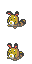 Sentret</td><td align="right">30.0%</td><td align="right">30.0%</td><td align="right">28.3%</td></tr>
<tr><td align="left">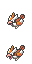 Pidgey</td><td align="right">20.0%</td><td align="right">20.0%</td><td align="right">19.2%</td></tr>
<tr><td align="left">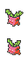 Hoppip</td><td align="right">15.0%</td><td align="right">15.0%</td><td align="right">14.1%</td></tr>
<tr><td align="left">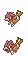 Pidgeotto</td><td align="right">15.0%</td><td align="right">15.0%</td><td align="right">14.1%</td></tr>
<tr><td align="left">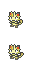 Meowth</td><td align="right">10.0%</td><td align="right">10.0%</td><td align="right">9.1%</td></tr>
<tr><td align="left">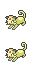 Persian</td><td align="right">5.0%</td><td align="right">5.0%</td><td align="right">5.1%</td></tr>
<tr><td align="left"> Psyduck</td><td align="right">5.0%</td><td align="right">0.0%</td><td align="right">5.1%</td></tr>
<tr><td align="left"> Slowpoke</td><td align="right">0.0%</td><td align="right">5.0%</td><td align="right">5.1%</td></tr>
</table>

<b>fishing / good_rod</b>

<table align="center">
<tr><th align="left">Pokemon</th><th align="right">FireRed</th><th align="right">LeafGreen</th><th align="right">Merged</th></tr>
<tr><td align="left"> Horsea</td><td align="right">80.0%</td><td align="right">0.0%</td><td align="right">40.0%</td></tr>
<tr><td align="left"> Krabby</td><td align="right">0.0%</td><td align="right">80.0%</td><td align="right">40.0%</td></tr>
</table>

<b>fishing / super_rod</b>

<table align="center">
<tr><th align="left">Pokemon</th><th align="right">FireRed</th><th align="right">LeafGreen</th><th align="right">Merged</th></tr>
<tr><td align="left"> Horsea</td><td align="right">40.0%</td><td align="right">0.0%</td><td align="right">19.8%</td></tr>
<tr><td align="left"> Krabby</td><td align="right">0.0%</td><td align="right">40.0%</td><td align="right">19.8%</td></tr>
<tr><td align="left">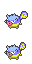 Qwilfish</td><td align="right">40.0%</td><td align="right">0.0%</td><td align="right">19.8%</td></tr>
<tr><td align="left">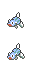 Remoraid</td><td align="right">0.0%</td><td align="right">40.0%</td><td align="right">19.8%</td></tr>
<tr><td align="left"> Gyarados</td><td align="right">15.0%</td><td align="right">15.0%</td><td align="right">14.9%</td></tr>
<tr><td align="left"> Kingler</td><td align="right">0.0%</td><td align="right">4.0%</td><td align="right">2.0%</td></tr>
<tr><td align="left"> Seadra</td><td align="right">4.0%</td><td align="right">0.0%</td><td align="right">2.0%</td></tr>
<tr><td align="left"> Psyduck</td><td align="right">1.0%</td><td align="right">0.0%</td><td align="right">1.0%</td></tr>
<tr><td align="left"> Slowpoke</td><td align="right">0.0%</td><td align="right">1.0%</td><td align="right">1.0%</td></tr>
</table>

<h2 style="display:inline-block;margin:0;vertical-align:middle">FiveIslandMemorialPillar</h2>

<b>fishing / good_rod</b>

<table align="center">
<tr><th align="left">Pokemon</th><th align="right">FireRed</th><th align="right">LeafGreen</th><th align="right">Merged</th></tr>
<tr><td align="left"> Horsea</td><td align="right">80.0%</td><td align="right">0.0%</td><td align="right">40.0%</td></tr>
<tr><td align="left"> Krabby</td><td align="right">0.0%</td><td align="right">80.0%</td><td align="right">40.0%</td></tr>
</table>

<b>fishing / super_rod</b>

<table align="center">
<tr><th align="left">Pokemon</th><th align="right">FireRed</th><th align="right">LeafGreen</th><th align="right">Merged</th></tr>
<tr><td align="left"> Horsea</td><td align="right">40.0%</td><td align="right">0.0%</td><td align="right">19.8%</td></tr>
<tr><td align="left"> Krabby</td><td align="right">0.0%</td><td align="right">40.0%</td><td align="right">19.8%</td></tr>
<tr><td align="left"> Qwilfish</td><td align="right">40.0%</td><td align="right">0.0%</td><td align="right">19.8%</td></tr>
<tr><td align="left"> Remoraid</td><td align="right">0.0%</td><td align="right">40.0%</td><td align="right">19.8%</td></tr>
<tr><td align="left"> Gyarados</td><td align="right">15.0%</td><td align="right">15.0%</td><td align="right">14.9%</td></tr>
<tr><td align="left"> Kingler</td><td align="right">0.0%</td><td align="right">4.0%</td><td align="right">2.0%</td></tr>
<tr><td align="left"> Seadra</td><td align="right">4.0%</td><td align="right">0.0%</td><td align="right">2.0%</td></tr>
<tr><td align="left"> Psyduck</td><td align="right">1.0%</td><td align="right">0.0%</td><td align="right">1.0%</td></tr>
<tr><td align="left"> Slowpoke</td><td align="right">0.0%</td><td align="right">1.0%</td><td align="right">1.0%</td></tr>
</table>

<h2 style="display:inline-block;margin:0;vertical-align:middle">FiveIslandResortGorgeous</h2>

<b>fishing / good_rod</b>

<table align="center">
<tr><th align="left">Pokemon</th><th align="right">FireRed</th><th align="right">LeafGreen</th><th align="right">Merged</th></tr>
<tr><td align="left"> Horsea</td><td align="right">80.0%</td><td align="right">0.0%</td><td align="right">40.0%</td></tr>
<tr><td align="left"> Krabby</td><td align="right">0.0%</td><td align="right">80.0%</td><td align="right">40.0%</td></tr>
</table>

<b>fishing / super_rod</b>

<table align="center">
<tr><th align="left">Pokemon</th><th align="right">FireRed</th><th align="right">LeafGreen</th><th align="right">Merged</th></tr>
<tr><td align="left"> Horsea</td><td align="right">40.0%</td><td align="right">0.0%</td><td align="right">19.8%</td></tr>
<tr><td align="left"> Krabby</td><td align="right">0.0%</td><td align="right">40.0%</td><td align="right">19.8%</td></tr>
<tr><td align="left"> Qwilfish</td><td align="right">40.0%</td><td align="right">0.0%</td><td align="right">19.8%</td></tr>
<tr><td align="left"> Remoraid</td><td align="right">0.0%</td><td align="right">40.0%</td><td align="right">19.8%</td></tr>
<tr><td align="left"> Gyarados</td><td align="right">15.0%</td><td align="right">15.0%</td><td align="right">14.9%</td></tr>
<tr><td align="left"> Kingler</td><td align="right">0.0%</td><td align="right">4.0%</td><td align="right">2.0%</td></tr>
<tr><td align="left"> Seadra</td><td align="right">4.0%</td><td align="right">0.0%</td><td align="right">2.0%</td></tr>
<tr><td align="left"> Psyduck</td><td align="right">1.0%</td><td align="right">0.0%</td><td align="right">1.0%</td></tr>
<tr><td align="left"> Slowpoke</td><td align="right">0.0%</td><td align="right">1.0%</td><td align="right">1.0%</td></tr>
</table>

<h2 style="display:inline-block;margin:0;vertical-align:middle">FiveIslandWaterLabyrinth</h2>

<b>fishing / good_rod</b>

<table align="center">
<tr><th align="left">Pokemon</th><th align="right">FireRed</th><th align="right">LeafGreen</th><th align="right">Merged</th></tr>
<tr><td align="left"> Horsea</td><td align="right">80.0%</td><td align="right">0.0%</td><td align="right">40.0%</td></tr>
<tr><td align="left"> Krabby</td><td align="right">0.0%</td><td align="right">80.0%</td><td align="right">40.0%</td></tr>
</table>

<b>fishing / super_rod</b>

<table align="center">
<tr><th align="left">Pokemon</th><th align="right">FireRed</th><th align="right">LeafGreen</th><th align="right">Merged</th></tr>
<tr><td align="left"> Horsea</td><td align="right">40.0%</td><td align="right">0.0%</td><td align="right">19.8%</td></tr>
<tr><td align="left"> Krabby</td><td align="right">0.0%</td><td align="right">40.0%</td><td align="right">19.8%</td></tr>
<tr><td align="left"> Qwilfish</td><td align="right">40.0%</td><td align="right">0.0%</td><td align="right">19.8%</td></tr>
<tr><td align="left"> Remoraid</td><td align="right">0.0%</td><td align="right">40.0%</td><td align="right">19.8%</td></tr>
<tr><td align="left"> Gyarados</td><td align="right">15.0%</td><td align="right">15.0%</td><td align="right">14.9%</td></tr>
<tr><td align="left"> Kingler</td><td align="right">0.0%</td><td align="right">4.0%</td><td align="right">2.0%</td></tr>
<tr><td align="left"> Seadra</td><td align="right">4.0%</td><td align="right">0.0%</td><td align="right">2.0%</td></tr>
<tr><td align="left"> Psyduck</td><td align="right">1.0%</td><td align="right">0.0%</td><td align="right">1.0%</td></tr>
<tr><td align="left"> Slowpoke</td><td align="right">0.0%</td><td align="right">1.0%</td><td align="right">1.0%</td></tr>
</table>

<h2 style="display:inline-block;margin:0;vertical-align:middle">FourIsland</h2>

<b>water</b>

<table align="center">
<tr><th align="left">Pokemon</th><th align="right">FireRed</th><th align="right">LeafGreen</th><th align="right">Merged</th></tr>
<tr><td align="left">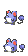 Marill</td><td align="right">0.0%</td><td align="right">70.0%</td><td align="right">35.0%</td></tr>
<tr><td align="left">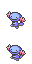 Wooper</td><td align="right">70.0%</td><td align="right">0.0%</td><td align="right">35.0%</td></tr>
<tr><td align="left"> Psyduck</td><td align="right">30.0%</td><td align="right">0.0%</td><td align="right">15.0%</td></tr>
<tr><td align="left"> Slowpoke</td><td align="right">0.0%</td><td align="right">30.0%</td><td align="right">15.0%</td></tr>
</table>

<b>fishing / super_rod</b>

<table align="center">
<tr><th align="left">Pokemon</th><th align="right">FireRed</th><th align="right">LeafGreen</th><th align="right">Merged</th></tr>
<tr><td align="left"> Poliwag</td><td align="right">40.0%</td><td align="right">40.0%</td><td align="right">38.0%</td></tr>
<tr><td align="left"> Poliwhirl</td><td align="right">40.0%</td><td align="right">40.0%</td><td align="right">38.0%</td></tr>
<tr><td align="left"> Gyarados</td><td align="right">15.0%</td><td align="right">15.0%</td><td align="right">14.0%</td></tr>
<tr><td align="left"> Psyduck</td><td align="right">5.0%</td><td align="right">0.0%</td><td align="right">5.0%</td></tr>
<tr><td align="left"> Slowpoke</td><td align="right">0.0%</td><td align="right">5.0%</td><td align="right">5.0%</td></tr>
</table>

<h2 style="display:inline-block;margin:0;vertical-align:middle">FourIslandIcefallCave1F</h2>

<b>land</b>

<table align="center">
<tr><th align="left">Pokemon</th><th align="right">FireRed</th><th align="right">LeafGreen</th><th align="right">Merged</th></tr>
<tr><td align="left">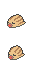 Swinub</td><td align="right">50.0%</td><td align="right">50.0%</td><td align="right">47.5%</td></tr>
<tr><td align="left"> Golbat</td><td align="right">25.0%</td><td align="right">25.0%</td><td align="right">24.2%</td></tr>
<tr><td align="left">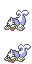 Seel</td><td align="right">10.0%</td><td align="right">10.0%</td><td align="right">9.1%</td></tr>
<tr><td align="left"> Zubat</td><td align="right">10.0%</td><td align="right">10.0%</td><td align="right">9.1%</td></tr>
<tr><td align="left">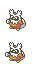 Delibird</td><td align="right">5.0%</td><td align="right">0.0%</td><td align="right">5.1%</td></tr>
<tr><td align="left">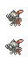 Sneasel</td><td align="right">0.0%</td><td align="right">5.0%</td><td align="right">5.1%</td></tr>
</table>

<h2 style="display:inline-block;margin:0;vertical-align:middle">FourIslandIcefallCaveB1F</h2>

<b>land</b>

<table align="center">
<tr><th align="left">Pokemon</th><th align="right">FireRed</th><th align="right">LeafGreen</th><th align="right">Merged</th></tr>
<tr><td align="left"> Swinub</td><td align="right">50.0%</td><td align="right">50.0%</td><td align="right">47.5%</td></tr>
<tr><td align="left"> Golbat</td><td align="right">25.0%</td><td align="right">25.0%</td><td align="right">24.2%</td></tr>
<tr><td align="left"> Seel</td><td align="right">10.0%</td><td align="right">10.0%</td><td align="right">9.1%</td></tr>
<tr><td align="left"> Zubat</td><td align="right">10.0%</td><td align="right">10.0%</td><td align="right">9.1%</td></tr>
<tr><td align="left"> Delibird</td><td align="right">5.0%</td><td align="right">0.0%</td><td align="right">5.1%</td></tr>
<tr><td align="left"> Sneasel</td><td align="right">0.0%</td><td align="right">5.0%</td><td align="right">5.1%</td></tr>
</table>

<h2 style="display:inline-block;margin:0;vertical-align:middle">FourIslandIcefallCaveBack</h2>

<b>land</b>

<table align="center">
<tr><th align="left">Pokemon</th><th align="right">FireRed</th><th align="right">LeafGreen</th><th align="right">Merged</th></tr>
<tr><td align="left"> Seel</td><td align="right">40.0%</td><td align="right">40.0%</td><td align="right">38.0%</td></tr>
<tr><td align="left"> Golbat</td><td align="right">25.0%</td><td align="right">25.0%</td><td align="right">24.0%</td></tr>
<tr><td align="left">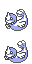 Dewgong</td><td align="right">20.0%</td><td align="right">20.0%</td><td align="right">19.0%</td></tr>
<tr><td align="left"> Zubat</td><td align="right">10.0%</td><td align="right">10.0%</td><td align="right">9.0%</td></tr>
<tr><td align="left"> Psyduck</td><td align="right">5.0%</td><td align="right">0.0%</td><td align="right">5.0%</td></tr>
<tr><td align="left"> Slowpoke</td><td align="right">0.0%</td><td align="right">5.0%</td><td align="right">5.0%</td></tr>
</table>

<b>fishing / good_rod</b>

<table align="center">
<tr><th align="left">Pokemon</th><th align="right">FireRed</th><th align="right">LeafGreen</th><th align="right">Merged</th></tr>
<tr><td align="left"> Horsea</td><td align="right">80.0%</td><td align="right">0.0%</td><td align="right">40.0%</td></tr>
<tr><td align="left"> Krabby</td><td align="right">0.0%</td><td align="right">80.0%</td><td align="right">40.0%</td></tr>
</table>

<b>fishing / super_rod</b>

<table align="center">
<tr><th align="left">Pokemon</th><th align="right">FireRed</th><th align="right">LeafGreen</th><th align="right">Merged</th></tr>
<tr><td align="left"> Horsea</td><td align="right">40.0%</td><td align="right">0.0%</td><td align="right">19.8%</td></tr>
<tr><td align="left"> Krabby</td><td align="right">0.0%</td><td align="right">40.0%</td><td align="right">19.8%</td></tr>
<tr><td align="left"> Shellder</td><td align="right">40.0%</td><td align="right">0.0%</td><td align="right">19.8%</td></tr>
<tr><td align="left"> Staryu</td><td align="right">0.0%</td><td align="right">40.0%</td><td align="right">19.8%</td></tr>
<tr><td align="left"> Gyarados</td><td align="right">15.0%</td><td align="right">15.0%</td><td align="right">14.9%</td></tr>
<tr><td align="left"> Kingler</td><td align="right">0.0%</td><td align="right">4.0%</td><td align="right">2.0%</td></tr>
<tr><td align="left"> Seadra</td><td align="right">4.0%</td><td align="right">0.0%</td><td align="right">2.0%</td></tr>
<tr><td align="left"> Psyduck</td><td align="right">1.0%</td><td align="right">0.0%</td><td align="right">1.0%</td></tr>
<tr><td align="left"> Slowpoke</td><td align="right">0.0%</td><td align="right">1.0%</td><td align="right">1.0%</td></tr>
</table>

<h2 style="display:inline-block;margin:0;vertical-align:middle">FourIslandIcefallCaveEntrance</h2>

<b>land</b>

<table align="center">
<tr><th align="left">Pokemon</th><th align="right">FireRed</th><th align="right">LeafGreen</th><th align="right">Merged</th></tr>
<tr><td align="left"> Seel</td><td align="right">40.0%</td><td align="right">40.0%</td><td align="right">38.0%</td></tr>
<tr><td align="left"> Golbat</td><td align="right">25.0%</td><td align="right">25.0%</td><td align="right">24.0%</td></tr>
<tr><td align="left"> Dewgong</td><td align="right">20.0%</td><td align="right">20.0%</td><td align="right">19.0%</td></tr>
<tr><td align="left"> Zubat</td><td align="right">10.0%</td><td align="right">10.0%</td><td align="right">9.0%</td></tr>
<tr><td align="left"> Psyduck</td><td align="right">5.0%</td><td align="right">0.0%</td><td align="right">5.0%</td></tr>
<tr><td align="left"> Slowpoke</td><td align="right">0.0%</td><td align="right">5.0%</td><td align="right">5.0%</td></tr>
</table>

<b>water</b>

<table align="center">
<tr><th align="left">Pokemon</th><th align="right">FireRed</th><th align="right">LeafGreen</th><th align="right">Merged</th></tr>
<tr><td align="left"> Psyduck</td><td align="right">30.0%</td><td align="right">0.0%</td><td align="right">30.0%</td></tr>
<tr><td align="left"> Slowpoke</td><td align="right">0.0%</td><td align="right">30.0%</td><td align="right">30.0%</td></tr>
<tr><td align="left"> Seel</td><td align="right">60.0%</td><td align="right">60.0%</td><td align="right">28.0%</td></tr>
<tr><td align="left"> Marill</td><td align="right">0.0%</td><td align="right">5.0%</td><td align="right">5.0%</td></tr>
<tr><td align="left"> Wooper</td><td align="right">5.0%</td><td align="right">0.0%</td><td align="right">5.0%</td></tr>
<tr><td align="left"> Dewgong</td><td align="right">5.0%</td><td align="right">5.0%</td><td align="right">2.0%</td></tr>
</table>

<b>fishing / super_rod</b>

<table align="center">
<tr><th align="left">Pokemon</th><th align="right">FireRed</th><th align="right">LeafGreen</th><th align="right">Merged</th></tr>
<tr><td align="left"> Poliwag</td><td align="right">40.0%</td><td align="right">40.0%</td><td align="right">38.0%</td></tr>
<tr><td align="left"> Poliwhirl</td><td align="right">40.0%</td><td align="right">40.0%</td><td align="right">38.0%</td></tr>
<tr><td align="left"> Gyarados</td><td align="right">15.0%</td><td align="right">15.0%</td><td align="right">14.0%</td></tr>
<tr><td align="left"> Psyduck</td><td align="right">5.0%</td><td align="right">0.0%</td><td align="right">5.0%</td></tr>
<tr><td align="left"> Slowpoke</td><td align="right">0.0%</td><td align="right">5.0%</td><td align="right">5.0%</td></tr>
</table>

<h2 style="display:inline-block;margin:0;vertical-align:middle">FuchsiaCity</h2>

<b>water</b>

<table align="center">
<tr><th align="left">Pokemon</th><th align="right">FireRed</th><th align="right">LeafGreen</th><th align="right">Merged</th></tr>
<tr><td align="left"> Psyduck</td><td align="right">100.0%</td><td align="right">0.0%</td><td align="right">50.0%</td></tr>
<tr><td align="left"> Slowpoke</td><td align="right">0.0%</td><td align="right">100.0%</td><td align="right">50.0%</td></tr>
</table>

<b>fishing / super_rod</b>

<table align="center">
<tr><th align="left">Pokemon</th><th align="right">FireRed</th><th align="right">LeafGreen</th><th align="right">Merged</th></tr>
<tr><td align="left">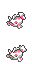 Goldeen</td><td align="right">40.0%</td><td align="right">40.0%</td><td align="right">38.0%</td></tr>
<tr><td align="left">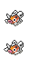 Seaking</td><td align="right">40.0%</td><td align="right">40.0%</td><td align="right">38.0%</td></tr>
<tr><td align="left"> Gyarados</td><td align="right">15.0%</td><td align="right">15.0%</td><td align="right">14.0%</td></tr>
<tr><td align="left"> Psyduck</td><td align="right">5.0%</td><td align="right">0.0%</td><td align="right">5.0%</td></tr>
<tr><td align="left"> Slowpoke</td><td align="right">0.0%</td><td align="right">5.0%</td><td align="right">5.0%</td></tr>
</table>

<h2 style="display:inline-block;margin:0;vertical-align:middle">MtEmberExterior</h2>

<b>land</b>

<table align="center">
<tr><th align="left">Pokemon</th><th align="right">FireRed</th><th align="right">LeafGreen</th><th align="right">Merged</th></tr>
<tr><td align="left">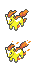 Ponyta</td><td align="right">35.0%</td><td align="right">35.0%</td><td align="right">34.0%</td></tr>
<tr><td align="left">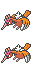 Fearow</td><td align="right">25.0%</td><td align="right">25.0%</td><td align="right">24.0%</td></tr>
<tr><td align="left">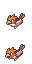 Spearow</td><td align="right">15.0%</td><td align="right">10.0%</td><td align="right">12.0%</td></tr>
<tr><td align="left">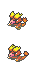 Magmar</td><td align="right">0.0%</td><td align="right">5.0%</td><td align="right">5.0%</td></tr>
</table>

<h2 style="display:inline-block;margin:0;vertical-align:middle">OneIsland</h2>

<b>fishing / good_rod</b>

<table align="center">
<tr><th align="left">Pokemon</th><th align="right">FireRed</th><th align="right">LeafGreen</th><th align="right">Merged</th></tr>
<tr><td align="left"> Horsea</td><td align="right">80.0%</td><td align="right">0.0%</td><td align="right">40.0%</td></tr>
<tr><td align="left"> Krabby</td><td align="right">0.0%</td><td align="right">80.0%</td><td align="right">40.0%</td></tr>
</table>

<b>fishing / super_rod</b>

<table align="center">
<tr><th align="left">Pokemon</th><th align="right">FireRed</th><th align="right">LeafGreen</th><th align="right">Merged</th></tr>
<tr><td align="left"> Horsea</td><td align="right">40.0%</td><td align="right">0.0%</td><td align="right">19.8%</td></tr>
<tr><td align="left"> Krabby</td><td align="right">0.0%</td><td align="right">40.0%</td><td align="right">19.8%</td></tr>
<tr><td align="left"> Shellder</td><td align="right">40.0%</td><td align="right">0.0%</td><td align="right">19.8%</td></tr>
<tr><td align="left"> Staryu</td><td align="right">0.0%</td><td align="right">40.0%</td><td align="right">19.8%</td></tr>
<tr><td align="left"> Gyarados</td><td align="right">15.0%</td><td align="right">15.0%</td><td align="right">14.9%</td></tr>
<tr><td align="left"> Kingler</td><td align="right">0.0%</td><td align="right">4.0%</td><td align="right">2.0%</td></tr>
<tr><td align="left"> Seadra</td><td align="right">4.0%</td><td align="right">0.0%</td><td align="right">2.0%</td></tr>
<tr><td align="left"> Psyduck</td><td align="right">1.0%</td><td align="right">0.0%</td><td align="right">1.0%</td></tr>
<tr><td align="left"> Slowpoke</td><td align="right">0.0%</td><td align="right">1.0%</td><td align="right">1.0%</td></tr>
</table>

<h2 style="display:inline-block;margin:0;vertical-align:middle">OneIslandKindleRoad</h2>

<b>land</b>

<table align="center">
<tr><th align="left">Pokemon</th><th align="right">FireRed</th><th align="right">LeafGreen</th><th align="right">Merged</th></tr>
<tr><td align="left"> Ponyta</td><td align="right">30.0%</td><td align="right">30.0%</td><td align="right">28.3%</td></tr>
<tr><td align="left"> Spearow</td><td align="right">25.0%</td><td align="right">25.0%</td><td align="right">24.2%</td></tr>
<tr><td align="left"> Fearow</td><td align="right">10.0%</td><td align="right">10.0%</td><td align="right">9.1%</td></tr>
<tr><td align="left">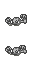 Geodude</td><td align="right">10.0%</td><td align="right">10.0%</td><td align="right">9.1%</td></tr>
<tr><td align="left"> Meowth</td><td align="right">10.0%</td><td align="right">10.0%</td><td align="right">9.1%</td></tr>
<tr><td align="left"> Persian</td><td align="right">5.0%</td><td align="right">5.0%</td><td align="right">5.1%</td></tr>
<tr><td align="left"> Psyduck</td><td align="right">5.0%</td><td align="right">0.0%</td><td align="right">5.1%</td></tr>
<tr><td align="left">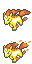 Rapidash</td><td align="right">5.0%</td><td align="right">5.0%</td><td align="right">5.1%</td></tr>
<tr><td align="left"> Slowpoke</td><td align="right">0.0%</td><td align="right">5.0%</td><td align="right">5.1%</td></tr>
</table>

<b>fishing / good_rod</b>

<table align="center">
<tr><th align="left">Pokemon</th><th align="right">FireRed</th><th align="right">LeafGreen</th><th align="right">Merged</th></tr>
<tr><td align="left"> Horsea</td><td align="right">80.0%</td><td align="right">0.0%</td><td align="right">40.0%</td></tr>
<tr><td align="left"> Krabby</td><td align="right">0.0%</td><td align="right">80.0%</td><td align="right">40.0%</td></tr>
</table>

<b>fishing / super_rod</b>

<table align="center">
<tr><th align="left">Pokemon</th><th align="right">FireRed</th><th align="right">LeafGreen</th><th align="right">Merged</th></tr>
<tr><td align="left"> Horsea</td><td align="right">80.0%</td><td align="right">0.0%</td><td align="right">39.6%</td></tr>
<tr><td align="left"> Krabby</td><td align="right">0.0%</td><td align="right">80.0%</td><td align="right">39.6%</td></tr>
<tr><td align="left"> Gyarados</td><td align="right">15.0%</td><td align="right">15.0%</td><td align="right">14.9%</td></tr>
<tr><td align="left"> Kingler</td><td align="right">0.0%</td><td align="right">4.0%</td><td align="right">2.0%</td></tr>
<tr><td align="left"> Seadra</td><td align="right">4.0%</td><td align="right">0.0%</td><td align="right">2.0%</td></tr>
<tr><td align="left"> Psyduck</td><td align="right">1.0%</td><td align="right">0.0%</td><td align="right">1.0%</td></tr>
<tr><td align="left"> Slowpoke</td><td align="right">0.0%</td><td align="right">1.0%</td><td align="right">1.0%</td></tr>
</table>

<h2 style="display:inline-block;margin:0;vertical-align:middle">OneIslandTreasureBeach</h2>

<b>land</b>

<table align="center">
<tr><th align="left">Pokemon</th><th align="right">FireRed</th><th align="right">LeafGreen</th><th align="right">Merged</th></tr>
<tr><td align="left"> Spearow</td><td align="right">30.0%</td><td align="right">30.0%</td><td align="right">28.3%</td></tr>
<tr><td align="left">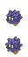 Tangela</td><td align="right">30.0%</td><td align="right">30.0%</td><td align="right">28.3%</td></tr>
<tr><td align="left"> Fearow</td><td align="right">20.0%</td><td align="right">20.0%</td><td align="right">19.2%</td></tr>
<tr><td align="left"> Meowth</td><td align="right">10.0%</td><td align="right">10.0%</td><td align="right">9.1%</td></tr>
<tr><td align="left"> Persian</td><td align="right">5.0%</td><td align="right">5.0%</td><td align="right">5.1%</td></tr>
<tr><td align="left"> Psyduck</td><td align="right">5.0%</td><td align="right">0.0%</td><td align="right">5.1%</td></tr>
<tr><td align="left"> Slowpoke</td><td align="right">0.0%</td><td align="right">5.0%</td><td align="right">5.1%</td></tr>
</table>

<b>fishing / good_rod</b>

<table align="center">
<tr><th align="left">Pokemon</th><th align="right">FireRed</th><th align="right">LeafGreen</th><th align="right">Merged</th></tr>
<tr><td align="left"> Horsea</td><td align="right">80.0%</td><td align="right">0.0%</td><td align="right">40.0%</td></tr>
<tr><td align="left"> Krabby</td><td align="right">0.0%</td><td align="right">80.0%</td><td align="right">40.0%</td></tr>
</table>

<b>fishing / super_rod</b>

<table align="center">
<tr><th align="left">Pokemon</th><th align="right">FireRed</th><th align="right">LeafGreen</th><th align="right">Merged</th></tr>
<tr><td align="left"> Horsea</td><td align="right">80.0%</td><td align="right">0.0%</td><td align="right">39.6%</td></tr>
<tr><td align="left"> Krabby</td><td align="right">0.0%</td><td align="right">80.0%</td><td align="right">39.6%</td></tr>
<tr><td align="left"> Gyarados</td><td align="right">15.0%</td><td align="right">15.0%</td><td align="right">14.9%</td></tr>
<tr><td align="left"> Kingler</td><td align="right">0.0%</td><td align="right">4.0%</td><td align="right">2.0%</td></tr>
<tr><td align="left"> Seadra</td><td align="right">4.0%</td><td align="right">0.0%</td><td align="right">2.0%</td></tr>
<tr><td align="left"> Psyduck</td><td align="right">1.0%</td><td align="right">0.0%</td><td align="right">1.0%</td></tr>
<tr><td align="left"> Slowpoke</td><td align="right">0.0%</td><td align="right">1.0%</td><td align="right">1.0%</td></tr>
</table>

<h2 style="display:inline-block;margin:0;vertical-align:middle">PalletTown</h2>

<b>fishing / good_rod</b>

<table align="center">
<tr><th align="left">Pokemon</th><th align="right">FireRed</th><th align="right">LeafGreen</th><th align="right">Merged</th></tr>
<tr><td align="left"> Horsea</td><td align="right">60.0%</td><td align="right">20.0%</td><td align="right">40.0%</td></tr>
<tr><td align="left"> Krabby</td><td align="right">20.0%</td><td align="right">60.0%</td><td align="right">40.0%</td></tr>
</table>

<b>fishing / super_rod</b>

<table align="center">
<tr><th align="left">Pokemon</th><th align="right">FireRed</th><th align="right">LeafGreen</th><th align="right">Merged</th></tr>
<tr><td align="left"> Horsea</td><td align="right">40.0%</td><td align="right">0.0%</td><td align="right">19.8%</td></tr>
<tr><td align="left"> Krabby</td><td align="right">0.0%</td><td align="right">40.0%</td><td align="right">19.8%</td></tr>
<tr><td align="left"> Shellder</td><td align="right">40.0%</td><td align="right">0.0%</td><td align="right">19.8%</td></tr>
<tr><td align="left"> Staryu</td><td align="right">0.0%</td><td align="right">40.0%</td><td align="right">19.8%</td></tr>
<tr><td align="left"> Gyarados</td><td align="right">15.0%</td><td align="right">15.0%</td><td align="right">14.9%</td></tr>
<tr><td align="left"> Kingler</td><td align="right">0.0%</td><td align="right">4.0%</td><td align="right">2.0%</td></tr>
<tr><td align="left"> Seadra</td><td align="right">4.0%</td><td align="right">0.0%</td><td align="right">2.0%</td></tr>
<tr><td align="left"> Psyduck</td><td align="right">1.0%</td><td align="right">0.0%</td><td align="right">1.0%</td></tr>
<tr><td align="left"> Slowpoke</td><td align="right">0.0%</td><td align="right">1.0%</td><td align="right">1.0%</td></tr>
</table>

<h2 style="display:inline-block;margin:0;vertical-align:middle">PokemonMansion1F</h2>

<b>land</b>

<table align="center">
<tr><th align="left">Pokemon</th><th align="right">FireRed</th><th align="right">LeafGreen</th><th align="right">Merged</th></tr>
<tr><td align="left">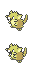 Raticate</td><td align="right">30.0%</td><td align="right">30.0%</td><td align="right">22.2%</td></tr>
<tr><td align="left">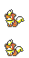 Growlithe</td><td align="right">15.0%</td><td align="right">0.0%</td><td align="right">15.2%</td></tr>
<tr><td align="left">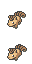 Vulpix</td><td align="right">0.0%</td><td align="right">15.0%</td><td align="right">15.2%</td></tr>
<tr><td align="left">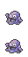 Grimer</td><td align="right">5.0%</td><td align="right">30.0%</td><td align="right">13.1%</td></tr>
<tr><td align="left">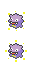 Koffing</td><td align="right">30.0%</td><td align="right">5.0%</td><td align="right">13.1%</td></tr>
<tr><td align="left">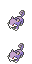 Rattata</td><td align="right">15.0%</td><td align="right">15.0%</td><td align="right">11.1%</td></tr>
<tr><td align="left">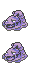 Muk</td><td align="right">0.0%</td><td align="right">5.0%</td><td align="right">5.1%</td></tr>
<tr><td align="left"> Weezing</td><td align="right">5.0%</td><td align="right">0.0%</td><td align="right">5.1%</td></tr>
</table>

<h2 style="display:inline-block;margin:0;vertical-align:middle">PokemonMansion2F</h2>

<b>land</b>

<table align="center">
<tr><th align="left">Pokemon</th><th align="right">FireRed</th><th align="right">LeafGreen</th><th align="right">Merged</th></tr>
<tr><td align="left"> Raticate</td><td align="right">30.0%</td><td align="right">30.0%</td><td align="right">22.2%</td></tr>
<tr><td align="left"> Growlithe</td><td align="right">15.0%</td><td align="right">0.0%</td><td align="right">15.2%</td></tr>
<tr><td align="left"> Vulpix</td><td align="right">0.0%</td><td align="right">15.0%</td><td align="right">15.2%</td></tr>
<tr><td align="left"> Grimer</td><td align="right">5.0%</td><td align="right">30.0%</td><td align="right">13.1%</td></tr>
<tr><td align="left"> Koffing</td><td align="right">30.0%</td><td align="right">5.0%</td><td align="right">13.1%</td></tr>
<tr><td align="left"> Rattata</td><td align="right">15.0%</td><td align="right">15.0%</td><td align="right">11.1%</td></tr>
<tr><td align="left"> Muk</td><td align="right">0.0%</td><td align="right">5.0%</td><td align="right">5.1%</td></tr>
<tr><td align="left"> Weezing</td><td align="right">5.0%</td><td align="right">0.0%</td><td align="right">5.1%</td></tr>
</table>

<h2 style="display:inline-block;margin:0;vertical-align:middle">PokemonMansion3F</h2>

<b>land</b>

<table align="center">
<tr><th align="left">Pokemon</th><th align="right">FireRed</th><th align="right">LeafGreen</th><th align="right">Merged</th></tr>
<tr><td align="left"> Raticate</td><td align="right">30.0%</td><td align="right">30.0%</td><td align="right">22.2%</td></tr>
<tr><td align="left"> Growlithe</td><td align="right">15.0%</td><td align="right">0.0%</td><td align="right">15.2%</td></tr>
<tr><td align="left"> Vulpix</td><td align="right">0.0%</td><td align="right">15.0%</td><td align="right">15.2%</td></tr>
<tr><td align="left"> Grimer</td><td align="right">5.0%</td><td align="right">30.0%</td><td align="right">13.1%</td></tr>
<tr><td align="left"> Koffing</td><td align="right">30.0%</td><td align="right">5.0%</td><td align="right">13.1%</td></tr>
<tr><td align="left"> Rattata</td><td align="right">15.0%</td><td align="right">15.0%</td><td align="right">11.1%</td></tr>
<tr><td align="left"> Muk</td><td align="right">0.0%</td><td align="right">5.0%</td><td align="right">5.1%</td></tr>
<tr><td align="left"> Weezing</td><td align="right">5.0%</td><td align="right">0.0%</td><td align="right">5.1%</td></tr>
</table>

<h2 style="display:inline-block;margin:0;vertical-align:middle">PokemonMansionB1F</h2>

<b>land</b>

<table align="center">
<tr><th align="left">Pokemon</th><th align="right">FireRed</th><th align="right">LeafGreen</th><th align="right">Merged</th></tr>
<tr><td align="left"> Raticate</td><td align="right">30.0%</td><td align="right">30.0%</td><td align="right">22.0%</td></tr>
<tr><td align="left"> Growlithe</td><td align="right">15.0%</td><td align="right">0.0%</td><td align="right">15.0%</td></tr>
<tr><td align="left"> Vulpix</td><td align="right">0.0%</td><td align="right">15.0%</td><td align="right">15.0%</td></tr>
<tr><td align="left"> Grimer</td><td align="right">5.0%</td><td align="right">30.0%</td><td align="right">13.0%</td></tr>
<tr><td align="left"> Koffing</td><td align="right">30.0%</td><td align="right">5.0%</td><td align="right">13.0%</td></tr>
<tr><td align="left"> Ditto</td><td align="right">10.0%</td><td align="right">10.0%</td><td align="right">8.0%</td></tr>
<tr><td align="left"> Muk</td><td align="right">0.0%</td><td align="right">5.0%</td><td align="right">5.0%</td></tr>
<tr><td align="left"> Weezing</td><td align="right">5.0%</td><td align="right">0.0%</td><td align="right">5.0%</td></tr>
<tr><td align="left"> Rattata</td><td align="right">5.0%</td><td align="right">5.0%</td><td align="right">4.0%</td></tr>
</table>

<h2 style="display:inline-block;margin:0;vertical-align:middle">PowerPlant</h2>

<b>land</b>

<table align="center">
<tr><th align="left">Pokemon</th><th align="right">FireRed</th><th align="right">LeafGreen</th><th align="right">Merged</th></tr>
<tr><td align="left"> Magnemite</td><td align="right">30.0%</td><td align="right">30.0%</td><td align="right">29.3%</td></tr>
<tr><td align="left"> Voltorb</td><td align="right">30.0%</td><td align="right">30.0%</td><td align="right">29.3%</td></tr>
<tr><td align="left"> Pikachu</td><td align="right">25.0%</td><td align="right">25.0%</td><td align="right">24.2%</td></tr>
<tr><td align="left"> Magneton</td><td align="right">10.0%</td><td align="right">15.0%</td><td align="right">12.1%</td></tr>
<tr><td align="left"> Electabuzz</td><td align="right">5.0%</td><td align="right">0.0%</td><td align="right">5.1%</td></tr>
</table>

<h2 style="display:inline-block;margin:0;vertical-align:middle">Route10</h2>

<b>land</b>

<table align="center">
<tr><th align="left">Pokemon</th><th align="right">FireRed</th><th align="right">LeafGreen</th><th align="right">Merged</th></tr>
<tr><td align="left"> Voltorb</td><td align="right">40.0%</td><td align="right">40.0%</td><td align="right">27.0%</td></tr>
<tr><td align="left"> Ekans</td><td align="right">25.0%</td><td align="right">0.0%</td><td align="right">25.0%</td></tr>
<tr><td align="left"> Sandshrew</td><td align="right">0.0%</td><td align="right">25.0%</td><td align="right">25.0%</td></tr>
<tr><td align="left"> Spearow</td><td align="right">35.0%</td><td align="right">35.0%</td><td align="right">23.0%</td></tr>
</table>

<b>fishing / good_rod</b>

<table align="center">
<tr><th align="left">Pokemon</th><th align="right">FireRed</th><th align="right">LeafGreen</th><th align="right">Merged</th></tr>
<tr><td align="left"> Horsea</td><td align="right">60.0%</td><td align="right">20.0%</td><td align="right">40.0%</td></tr>
<tr><td align="left"> Krabby</td><td align="right">20.0%</td><td align="right">60.0%</td><td align="right">40.0%</td></tr>
</table>

<b>fishing / super_rod</b>

<table align="center">
<tr><th align="left">Pokemon</th><th align="right">FireRed</th><th align="right">LeafGreen</th><th align="right">Merged</th></tr>
<tr><td align="left"> Horsea</td><td align="right">84.0%</td><td align="right">0.0%</td><td align="right">41.6%</td></tr>
<tr><td align="left"> Krabby</td><td align="right">0.0%</td><td align="right">84.0%</td><td align="right">41.6%</td></tr>
<tr><td align="left"> Gyarados</td><td align="right">15.0%</td><td align="right">15.0%</td><td align="right">14.9%</td></tr>
<tr><td align="left"> Psyduck</td><td align="right">1.0%</td><td align="right">0.0%</td><td align="right">1.0%</td></tr>
<tr><td align="left"> Slowpoke</td><td align="right">0.0%</td><td align="right">1.0%</td><td align="right">1.0%</td></tr>
</table>

<h2 style="display:inline-block;margin:0;vertical-align:middle">Route11</h2>

<b>land</b>

<table align="center">
<tr><th align="left">Pokemon</th><th align="right">FireRed</th><th align="right">LeafGreen</th><th align="right">Merged</th></tr>
<tr><td align="left"> Ekans</td><td align="right">40.0%</td><td align="right">0.0%</td><td align="right">40.0%</td></tr>
<tr><td align="left"> Sandshrew</td><td align="right">0.0%</td><td align="right">40.0%</td><td align="right">40.0%</td></tr>
<tr><td align="left"> Spearow</td><td align="right">35.0%</td><td align="right">35.0%</td><td align="right">12.0%</td></tr>
<tr><td align="left"> Drowzee</td><td align="right">25.0%</td><td align="right">25.0%</td><td align="right">8.0%</td></tr>
</table>

<b>fishing / good_rod</b>

<table align="center">
<tr><th align="left">Pokemon</th><th align="right">FireRed</th><th align="right">LeafGreen</th><th align="right">Merged</th></tr>
<tr><td align="left"> Horsea</td><td align="right">60.0%</td><td align="right">20.0%</td><td align="right">40.0%</td></tr>
<tr><td align="left"> Krabby</td><td align="right">20.0%</td><td align="right">60.0%</td><td align="right">40.0%</td></tr>
</table>

<b>fishing / super_rod</b>

<table align="center">
<tr><th align="left">Pokemon</th><th align="right">FireRed</th><th align="right">LeafGreen</th><th align="right">Merged</th></tr>
<tr><td align="left"> Horsea</td><td align="right">84.0%</td><td align="right">0.0%</td><td align="right">41.6%</td></tr>
<tr><td align="left"> Krabby</td><td align="right">0.0%</td><td align="right">84.0%</td><td align="right">41.6%</td></tr>
<tr><td align="left"> Gyarados</td><td align="right">15.0%</td><td align="right">15.0%</td><td align="right">14.9%</td></tr>
<tr><td align="left"> Psyduck</td><td align="right">1.0%</td><td align="right">0.0%</td><td align="right">1.0%</td></tr>
<tr><td align="left"> Slowpoke</td><td align="right">0.0%</td><td align="right">1.0%</td><td align="right">1.0%</td></tr>
</table>

<h2 style="display:inline-block;margin:0;vertical-align:middle">Route12</h2>

<b>land</b>

<table align="center">
<tr><th align="left">Pokemon</th><th align="right">FireRed</th><th align="right">LeafGreen</th><th align="right">Merged</th></tr>
<tr><td align="left"> Bellsprout</td><td align="right">0.0%</td><td align="right">35.0%</td><td align="right">35.0%</td></tr>
<tr><td align="left"> Oddish</td><td align="right">35.0%</td><td align="right">0.0%</td><td align="right">35.0%</td></tr>
<tr><td align="left"> Pidgey</td><td align="right">30.0%</td><td align="right">30.0%</td><td align="right">10.0%</td></tr>
<tr><td align="left"> Venonat</td><td align="right">30.0%</td><td align="right">30.0%</td><td align="right">10.0%</td></tr>
<tr><td align="left"> Gloom</td><td align="right">5.0%</td><td align="right">0.0%</td><td align="right">5.0%</td></tr>
<tr><td align="left"> Weepinbell</td><td align="right">0.0%</td><td align="right">5.0%</td><td align="right">5.0%</td></tr>
</table>

<b>fishing / good_rod</b>

<table align="center">
<tr><th align="left">Pokemon</th><th align="right">FireRed</th><th align="right">LeafGreen</th><th align="right">Merged</th></tr>
<tr><td align="left"> Horsea</td><td align="right">60.0%</td><td align="right">20.0%</td><td align="right">40.0%</td></tr>
<tr><td align="left"> Krabby</td><td align="right">20.0%</td><td align="right">60.0%</td><td align="right">40.0%</td></tr>
</table>

<b>fishing / super_rod</b>

<table align="center">
<tr><th align="left">Pokemon</th><th align="right">FireRed</th><th align="right">LeafGreen</th><th align="right">Merged</th></tr>
<tr><td align="left"> Horsea</td><td align="right">84.0%</td><td align="right">0.0%</td><td align="right">41.6%</td></tr>
<tr><td align="left"> Krabby</td><td align="right">0.0%</td><td align="right">84.0%</td><td align="right">41.6%</td></tr>
<tr><td align="left"> Gyarados</td><td align="right">15.0%</td><td align="right">15.0%</td><td align="right">14.9%</td></tr>
<tr><td align="left"> Psyduck</td><td align="right">1.0%</td><td align="right">0.0%</td><td align="right">1.0%</td></tr>
<tr><td align="left"> Slowpoke</td><td align="right">0.0%</td><td align="right">1.0%</td><td align="right">1.0%</td></tr>
</table>

<h2 style="display:inline-block;margin:0;vertical-align:middle">Route13</h2>

<b>land</b>

<table align="center">
<tr><th align="left">Pokemon</th><th align="right">FireRed</th><th align="right">LeafGreen</th><th align="right">Merged</th></tr>
<tr><td align="left"> Bellsprout</td><td align="right">0.0%</td><td align="right">35.0%</td><td align="right">34.7%</td></tr>
<tr><td align="left"> Oddish</td><td align="right">35.0%</td><td align="right">0.0%</td><td align="right">34.7%</td></tr>
<tr><td align="left"> Venonat</td><td align="right">30.0%</td><td align="right">30.0%</td><td align="right">9.9%</td></tr>
<tr><td align="left"> Pidgey</td><td align="right">20.0%</td><td align="right">20.0%</td><td align="right">6.9%</td></tr>
<tr><td align="left"> Gloom</td><td align="right">5.0%</td><td align="right">0.0%</td><td align="right">5.0%</td></tr>
<tr><td align="left"> Weepinbell</td><td align="right">0.0%</td><td align="right">5.0%</td><td align="right">5.0%</td></tr>
<tr><td align="left"> Ditto</td><td align="right">5.0%</td><td align="right">5.0%</td><td align="right">2.0%</td></tr>
<tr><td align="left"> Pidgeotto</td><td align="right">5.0%</td><td align="right">5.0%</td><td align="right">2.0%</td></tr>
</table>

<b>fishing / good_rod</b>

<table align="center">
<tr><th align="left">Pokemon</th><th align="right">FireRed</th><th align="right">LeafGreen</th><th align="right">Merged</th></tr>
<tr><td align="left"> Horsea</td><td align="right">60.0%</td><td align="right">20.0%</td><td align="right">40.0%</td></tr>
<tr><td align="left"> Krabby</td><td align="right">20.0%</td><td align="right">60.0%</td><td align="right">40.0%</td></tr>
</table>

<b>fishing / super_rod</b>

<table align="center">
<tr><th align="left">Pokemon</th><th align="right">FireRed</th><th align="right">LeafGreen</th><th align="right">Merged</th></tr>
<tr><td align="left"> Horsea</td><td align="right">84.0%</td><td align="right">0.0%</td><td align="right">41.6%</td></tr>
<tr><td align="left"> Krabby</td><td align="right">0.0%</td><td align="right">84.0%</td><td align="right">41.6%</td></tr>
<tr><td align="left"> Gyarados</td><td align="right">15.0%</td><td align="right">15.0%</td><td align="right">14.9%</td></tr>
<tr><td align="left"> Psyduck</td><td align="right">1.0%</td><td align="right">0.0%</td><td align="right">1.0%</td></tr>
<tr><td align="left"> Slowpoke</td><td align="right">0.0%</td><td align="right">1.0%</td><td align="right">1.0%</td></tr>
</table>

<h2 style="display:inline-block;margin:0;vertical-align:middle">Route14</h2>

<b>land</b>

<table align="center">
<tr><th align="left">Pokemon</th><th align="right">FireRed</th><th align="right">LeafGreen</th><th align="right">Merged</th></tr>
<tr><td align="left"> Bellsprout</td><td align="right">0.0%</td><td align="right">35.0%</td><td align="right">35.0%</td></tr>
<tr><td align="left"> Oddish</td><td align="right">35.0%</td><td align="right">0.0%</td><td align="right">35.0%</td></tr>
<tr><td align="left"> Venonat</td><td align="right">30.0%</td><td align="right">30.0%</td><td align="right">10.0%</td></tr>
<tr><td align="left"> Ditto</td><td align="right">15.0%</td><td align="right">15.0%</td><td align="right">5.0%</td></tr>
<tr><td align="left"> Gloom</td><td align="right">5.0%</td><td align="right">0.0%</td><td align="right">5.0%</td></tr>
<tr><td align="left"> Weepinbell</td><td align="right">0.0%</td><td align="right">5.0%</td><td align="right">5.0%</td></tr>
<tr><td align="left"> Pidgey</td><td align="right">10.0%</td><td align="right">10.0%</td><td align="right">3.0%</td></tr>
<tr><td align="left"> Pidgeotto</td><td align="right">5.0%</td><td align="right">5.0%</td><td align="right">2.0%</td></tr>
</table>

<h2 style="display:inline-block;margin:0;vertical-align:middle">Route15</h2>

<b>land</b>

<table align="center">
<tr><th align="left">Pokemon</th><th align="right">FireRed</th><th align="right">LeafGreen</th><th align="right">Merged</th></tr>
<tr><td align="left"> Bellsprout</td><td align="right">0.0%</td><td align="right">35.0%</td><td align="right">34.7%</td></tr>
<tr><td align="left"> Oddish</td><td align="right">35.0%</td><td align="right">0.0%</td><td align="right">34.7%</td></tr>
<tr><td align="left"> Venonat</td><td align="right">30.0%</td><td align="right">30.0%</td><td align="right">9.9%</td></tr>
<tr><td align="left"> Pidgey</td><td align="right">20.0%</td><td align="right">20.0%</td><td align="right">6.9%</td></tr>
<tr><td align="left"> Gloom</td><td align="right">5.0%</td><td align="right">0.0%</td><td align="right">5.0%</td></tr>
<tr><td align="left"> Weepinbell</td><td align="right">0.0%</td><td align="right">5.0%</td><td align="right">5.0%</td></tr>
<tr><td align="left"> Ditto</td><td align="right">5.0%</td><td align="right">5.0%</td><td align="right">2.0%</td></tr>
<tr><td align="left"> Pidgeotto</td><td align="right">5.0%</td><td align="right">5.0%</td><td align="right">2.0%</td></tr>
</table>

<h2 style="display:inline-block;margin:0;vertical-align:middle">Route19</h2>

<b>fishing / good_rod</b>

<table align="center">
<tr><th align="left">Pokemon</th><th align="right">FireRed</th><th align="right">LeafGreen</th><th align="right">Merged</th></tr>
<tr><td align="left"> Horsea</td><td align="right">60.0%</td><td align="right">20.0%</td><td align="right">40.0%</td></tr>
<tr><td align="left"> Krabby</td><td align="right">20.0%</td><td align="right">60.0%</td><td align="right">40.0%</td></tr>
</table>

<b>fishing / super_rod</b>

<table align="center">
<tr><th align="left">Pokemon</th><th align="right">FireRed</th><th align="right">LeafGreen</th><th align="right">Merged</th></tr>
<tr><td align="left"> Horsea</td><td align="right">80.0%</td><td align="right">0.0%</td><td align="right">39.6%</td></tr>
<tr><td align="left"> Krabby</td><td align="right">0.0%</td><td align="right">80.0%</td><td align="right">39.6%</td></tr>
<tr><td align="left"> Gyarados</td><td align="right">15.0%</td><td align="right">15.0%</td><td align="right">14.9%</td></tr>
<tr><td align="left"> Kingler</td><td align="right">0.0%</td><td align="right">4.0%</td><td align="right">2.0%</td></tr>
<tr><td align="left"> Seadra</td><td align="right">4.0%</td><td align="right">0.0%</td><td align="right">2.0%</td></tr>
<tr><td align="left"> Psyduck</td><td align="right">1.0%</td><td align="right">0.0%</td><td align="right">1.0%</td></tr>
<tr><td align="left"> Slowpoke</td><td align="right">0.0%</td><td align="right">1.0%</td><td align="right">1.0%</td></tr>
</table>

<h2 style="display:inline-block;margin:0;vertical-align:middle">Route20</h2>

<b>fishing / good_rod</b>

<table align="center">
<tr><th align="left">Pokemon</th><th align="right">FireRed</th><th align="right">LeafGreen</th><th align="right">Merged</th></tr>
<tr><td align="left"> Horsea</td><td align="right">60.0%</td><td align="right">20.0%</td><td align="right">40.0%</td></tr>
<tr><td align="left"> Krabby</td><td align="right">20.0%</td><td align="right">60.0%</td><td align="right">40.0%</td></tr>
</table>

<b>fishing / super_rod</b>

<table align="center">
<tr><th align="left">Pokemon</th><th align="right">FireRed</th><th align="right">LeafGreen</th><th align="right">Merged</th></tr>
<tr><td align="left"> Horsea</td><td align="right">80.0%</td><td align="right">0.0%</td><td align="right">39.6%</td></tr>
<tr><td align="left"> Krabby</td><td align="right">0.0%</td><td align="right">80.0%</td><td align="right">39.6%</td></tr>
<tr><td align="left"> Gyarados</td><td align="right">15.0%</td><td align="right">15.0%</td><td align="right">14.9%</td></tr>
<tr><td align="left"> Kingler</td><td align="right">0.0%</td><td align="right">4.0%</td><td align="right">2.0%</td></tr>
<tr><td align="left"> Seadra</td><td align="right">4.0%</td><td align="right">0.0%</td><td align="right">2.0%</td></tr>
<tr><td align="left"> Psyduck</td><td align="right">1.0%</td><td align="right">0.0%</td><td align="right">1.0%</td></tr>
<tr><td align="left"> Slowpoke</td><td align="right">0.0%</td><td align="right">1.0%</td><td align="right">1.0%</td></tr>
</table>

<h2 style="display:inline-block;margin:0;vertical-align:middle">Route21North</h2>

<b>fishing / good_rod</b>

<table align="center">
<tr><th align="left">Pokemon</th><th align="right">FireRed</th><th align="right">LeafGreen</th><th align="right">Merged</th></tr>
<tr><td align="left"> Horsea</td><td align="right">60.0%</td><td align="right">20.0%</td><td align="right">40.0%</td></tr>
<tr><td align="left"> Krabby</td><td align="right">20.0%</td><td align="right">60.0%</td><td align="right">40.0%</td></tr>
</table>

<b>fishing / super_rod</b>

<table align="center">
<tr><th align="left">Pokemon</th><th align="right">FireRed</th><th align="right">LeafGreen</th><th align="right">Merged</th></tr>
<tr><td align="left"> Horsea</td><td align="right">80.0%</td><td align="right">0.0%</td><td align="right">39.6%</td></tr>
<tr><td align="left"> Krabby</td><td align="right">0.0%</td><td align="right">80.0%</td><td align="right">39.6%</td></tr>
<tr><td align="left"> Gyarados</td><td align="right">15.0%</td><td align="right">15.0%</td><td align="right">14.9%</td></tr>
<tr><td align="left"> Kingler</td><td align="right">0.0%</td><td align="right">4.0%</td><td align="right">2.0%</td></tr>
<tr><td align="left"> Seadra</td><td align="right">4.0%</td><td align="right">0.0%</td><td align="right">2.0%</td></tr>
<tr><td align="left"> Psyduck</td><td align="right">1.0%</td><td align="right">0.0%</td><td align="right">1.0%</td></tr>
<tr><td align="left"> Slowpoke</td><td align="right">0.0%</td><td align="right">1.0%</td><td align="right">1.0%</td></tr>
</table>

<h2 style="display:inline-block;margin:0;vertical-align:middle">Route21South</h2>

<b>fishing / good_rod</b>

<table align="center">
<tr><th align="left">Pokemon</th><th align="right">FireRed</th><th align="right">LeafGreen</th><th align="right">Merged</th></tr>
<tr><td align="left"> Horsea</td><td align="right">60.0%</td><td align="right">20.0%</td><td align="right">40.0%</td></tr>
<tr><td align="left"> Krabby</td><td align="right">20.0%</td><td align="right">60.0%</td><td align="right">40.0%</td></tr>
</table>

<b>fishing / super_rod</b>

<table align="center">
<tr><th align="left">Pokemon</th><th align="right">FireRed</th><th align="right">LeafGreen</th><th align="right">Merged</th></tr>
<tr><td align="left"> Horsea</td><td align="right">80.0%</td><td align="right">0.0%</td><td align="right">39.6%</td></tr>
<tr><td align="left"> Krabby</td><td align="right">0.0%</td><td align="right">80.0%</td><td align="right">39.6%</td></tr>
<tr><td align="left"> Gyarados</td><td align="right">15.0%</td><td align="right">15.0%</td><td align="right">14.9%</td></tr>
<tr><td align="left"> Kingler</td><td align="right">0.0%</td><td align="right">4.0%</td><td align="right">2.0%</td></tr>
<tr><td align="left"> Seadra</td><td align="right">4.0%</td><td align="right">0.0%</td><td align="right">2.0%</td></tr>
<tr><td align="left"> Psyduck</td><td align="right">1.0%</td><td align="right">0.0%</td><td align="right">1.0%</td></tr>
<tr><td align="left"> Slowpoke</td><td align="right">0.0%</td><td align="right">1.0%</td><td align="right">1.0%</td></tr>
</table>

<h2 style="display:inline-block;margin:0;vertical-align:middle">Route22</h2>

<b>water</b>

<table align="center">
<tr><th align="left">Pokemon</th><th align="right">FireRed</th><th align="right">LeafGreen</th><th align="right">Merged</th></tr>
<tr><td align="left"> Psyduck</td><td align="right">100.0%</td><td align="right">0.0%</td><td align="right">50.0%</td></tr>
<tr><td align="left"> Slowpoke</td><td align="right">0.0%</td><td align="right">100.0%</td><td align="right">50.0%</td></tr>
</table>

<b>fishing / super_rod</b>

<table align="center">
<tr><th align="left">Pokemon</th><th align="right">FireRed</th><th align="right">LeafGreen</th><th align="right">Merged</th></tr>
<tr><td align="left"> Poliwag</td><td align="right">40.0%</td><td align="right">40.0%</td><td align="right">38.0%</td></tr>
<tr><td align="left"> Poliwhirl</td><td align="right">40.0%</td><td align="right">40.0%</td><td align="right">38.0%</td></tr>
<tr><td align="left"> Gyarados</td><td align="right">15.0%</td><td align="right">15.0%</td><td align="right">14.0%</td></tr>
<tr><td align="left"> Psyduck</td><td align="right">5.0%</td><td align="right">0.0%</td><td align="right">5.0%</td></tr>
<tr><td align="left"> Slowpoke</td><td align="right">0.0%</td><td align="right">5.0%</td><td align="right">5.0%</td></tr>
</table>

<h2 style="display:inline-block;margin:0;vertical-align:middle">Route23</h2>

<b>land</b>

<table align="center">
<tr><th align="left">Pokemon</th><th align="right">FireRed</th><th align="right">LeafGreen</th><th align="right">Merged</th></tr>
<tr><td align="left"> Ekans</td><td align="right">20.0%</td><td align="right">0.0%</td><td align="right">20.0%</td></tr>
<tr><td align="left"> Mankey</td><td align="right">30.0%</td><td align="right">30.0%</td><td align="right">20.0%</td></tr>
<tr><td align="left"> Sandshrew</td><td align="right">0.0%</td><td align="right">20.0%</td><td align="right">20.0%</td></tr>
<tr><td align="left"> Fearow</td><td align="right">25.0%</td><td align="right">25.0%</td><td align="right">17.0%</td></tr>
<tr><td align="left"> Spearow</td><td align="right">15.0%</td><td align="right">15.0%</td><td align="right">10.0%</td></tr>
<tr><td align="left"> Arbok</td><td align="right">5.0%</td><td align="right">0.0%</td><td align="right">5.0%</td></tr>
<tr><td align="left"> Sandslash</td><td align="right">0.0%</td><td align="right">5.0%</td><td align="right">5.0%</td></tr>
<tr><td align="left"> Primeape</td><td align="right">5.0%</td><td align="right">5.0%</td><td align="right">3.0%</td></tr>
</table>

<b>water</b>

<table align="center">
<tr><th align="left">Pokemon</th><th align="right">FireRed</th><th align="right">LeafGreen</th><th align="right">Merged</th></tr>
<tr><td align="left"> Psyduck</td><td align="right">100.0%</td><td align="right">0.0%</td><td align="right">50.0%</td></tr>
<tr><td align="left"> Slowpoke</td><td align="right">0.0%</td><td align="right">100.0%</td><td align="right">50.0%</td></tr>
</table>

<b>fishing / super_rod</b>

<table align="center">
<tr><th align="left">Pokemon</th><th align="right">FireRed</th><th align="right">LeafGreen</th><th align="right">Merged</th></tr>
<tr><td align="left"> Poliwag</td><td align="right">40.0%</td><td align="right">40.0%</td><td align="right">38.0%</td></tr>
<tr><td align="left"> Poliwhirl</td><td align="right">40.0%</td><td align="right">40.0%</td><td align="right">38.0%</td></tr>
<tr><td align="left"> Gyarados</td><td align="right">15.0%</td><td align="right">15.0%</td><td align="right">14.0%</td></tr>
<tr><td align="left"> Psyduck</td><td align="right">5.0%</td><td align="right">0.0%</td><td align="right">5.0%</td></tr>
<tr><td align="left"> Slowpoke</td><td align="right">0.0%</td><td align="right">5.0%</td><td align="right">5.0%</td></tr>
</table>

<h2 style="display:inline-block;margin:0;vertical-align:middle">Route24</h2>

<b>land</b>

<table align="center">
<tr><th align="left">Pokemon</th><th align="right">FireRed</th><th align="right">LeafGreen</th><th align="right">Merged</th></tr>
<tr><td align="left"> Bellsprout</td><td align="right">0.0%</td><td align="right">25.0%</td><td align="right">25.0%</td></tr>
<tr><td align="left"> Oddish</td><td align="right">25.0%</td><td align="right">0.0%</td><td align="right">25.0%</td></tr>
<tr><td align="left"> Caterpie</td><td align="right">20.0%</td><td align="right">20.0%</td><td align="right">13.0%</td></tr>
<tr><td align="left"> Weedle</td><td align="right">20.0%</td><td align="right">20.0%</td><td align="right">13.0%</td></tr>
<tr><td align="left"> Abra</td><td align="right">15.0%</td><td align="right">15.0%</td><td align="right">10.0%</td></tr>
<tr><td align="left"> Pidgey</td><td align="right">15.0%</td><td align="right">15.0%</td><td align="right">10.0%</td></tr>
<tr><td align="left"> Kakuna</td><td align="right">4.0%</td><td align="right">1.0%</td><td align="right">2.0%</td></tr>
<tr><td align="left"> Metapod</td><td align="right">1.0%</td><td align="right">4.0%</td><td align="right">2.0%</td></tr>
</table>

<b>fishing / good_rod</b>

<table align="center">
<tr><th align="left">Pokemon</th><th align="right">FireRed</th><th align="right">LeafGreen</th><th align="right">Merged</th></tr>
<tr><td align="left"> Horsea</td><td align="right">60.0%</td><td align="right">20.0%</td><td align="right">40.0%</td></tr>
<tr><td align="left"> Krabby</td><td align="right">20.0%</td><td align="right">60.0%</td><td align="right">40.0%</td></tr>
</table>

<b>fishing / super_rod</b>

<table align="center">
<tr><th align="left">Pokemon</th><th align="right">FireRed</th><th align="right">LeafGreen</th><th align="right">Merged</th></tr>
<tr><td align="left"> Horsea</td><td align="right">84.0%</td><td align="right">0.0%</td><td align="right">41.6%</td></tr>
<tr><td align="left"> Krabby</td><td align="right">0.0%</td><td align="right">84.0%</td><td align="right">41.6%</td></tr>
<tr><td align="left"> Gyarados</td><td align="right">15.0%</td><td align="right">15.0%</td><td align="right">14.9%</td></tr>
<tr><td align="left"> Psyduck</td><td align="right">1.0%</td><td align="right">0.0%</td><td align="right">1.0%</td></tr>
<tr><td align="left"> Slowpoke</td><td align="right">0.0%</td><td align="right">1.0%</td><td align="right">1.0%</td></tr>
</table>

<h2 style="display:inline-block;margin:0;vertical-align:middle">Route25</h2>

<b>land</b>

<table align="center">
<tr><th align="left">Pokemon</th><th align="right">FireRed</th><th align="right">LeafGreen</th><th align="right">Merged</th></tr>
<tr><td align="left"> Bellsprout</td><td align="right">0.0%</td><td align="right">25.0%</td><td align="right">25.0%</td></tr>
<tr><td align="left"> Oddish</td><td align="right">25.0%</td><td align="right">0.0%</td><td align="right">25.0%</td></tr>
<tr><td align="left"> Caterpie</td><td align="right">20.0%</td><td align="right">20.0%</td><td align="right">13.0%</td></tr>
<tr><td align="left"> Weedle</td><td align="right">20.0%</td><td align="right">20.0%</td><td align="right">13.0%</td></tr>
<tr><td align="left"> Abra</td><td align="right">15.0%</td><td align="right">15.0%</td><td align="right">10.0%</td></tr>
<tr><td align="left"> Pidgey</td><td align="right">15.0%</td><td align="right">15.0%</td><td align="right">10.0%</td></tr>
<tr><td align="left"> Kakuna</td><td align="right">4.0%</td><td align="right">1.0%</td><td align="right">2.0%</td></tr>
<tr><td align="left"> Metapod</td><td align="right">1.0%</td><td align="right">4.0%</td><td align="right">2.0%</td></tr>
</table>

<b>water</b>

<table align="center">
<tr><th align="left">Pokemon</th><th align="right">FireRed</th><th align="right">LeafGreen</th><th align="right">Merged</th></tr>
<tr><td align="left"> Psyduck</td><td align="right">100.0%</td><td align="right">0.0%</td><td align="right">50.0%</td></tr>
<tr><td align="left"> Slowpoke</td><td align="right">0.0%</td><td align="right">100.0%</td><td align="right">50.0%</td></tr>
</table>

<b>fishing / super_rod</b>

<table align="center">
<tr><th align="left">Pokemon</th><th align="right">FireRed</th><th align="right">LeafGreen</th><th align="right">Merged</th></tr>
<tr><td align="left"> Poliwag</td><td align="right">40.0%</td><td align="right">40.0%</td><td align="right">38.0%</td></tr>
<tr><td align="left"> Poliwhirl</td><td align="right">40.0%</td><td align="right">40.0%</td><td align="right">38.0%</td></tr>
<tr><td align="left"> Gyarados</td><td align="right">15.0%</td><td align="right">15.0%</td><td align="right">14.0%</td></tr>
<tr><td align="left"> Psyduck</td><td align="right">5.0%</td><td align="right">0.0%</td><td align="right">5.0%</td></tr>
<tr><td align="left"> Slowpoke</td><td align="right">0.0%</td><td align="right">5.0%</td><td align="right">5.0%</td></tr>
</table>

<h2 style="display:inline-block;margin:0;vertical-align:middle">Route3</h2>

<b>land</b>

<table align="center">
<tr><th align="left">Pokemon</th><th align="right">FireRed</th><th align="right">LeafGreen</th><th align="right">Merged</th></tr>
<tr><td align="left"> Spearow</td><td align="right">35.0%</td><td align="right">35.0%</td><td align="right">34.7%</td></tr>
<tr><td align="left"> Pidgey</td><td align="right">30.0%</td><td align="right">30.0%</td><td align="right">29.7%</td></tr>
<tr><td align="left"> Jigglypuff</td><td align="right">10.0%</td><td align="right">10.0%</td><td align="right">9.9%</td></tr>
<tr><td align="left"> Mankey</td><td align="right">10.0%</td><td align="right">10.0%</td><td align="right">9.9%</td></tr>
<tr><td align="left"> Nidoran-F</td><td align="right">1.0%</td><td align="right">14.0%</td><td align="right">7.9%</td></tr>
<tr><td align="left"> Nidoran-M</td><td align="right">14.0%</td><td align="right">1.0%</td><td align="right">7.9%</td></tr>
</table>

<h2 style="display:inline-block;margin:0;vertical-align:middle">Route4</h2>

<b>land</b>

<table align="center">
<tr><th align="left">Pokemon</th><th align="right">FireRed</th><th align="right">LeafGreen</th><th align="right">Merged</th></tr>
<tr><td align="left"> Ekans</td><td align="right">25.0%</td><td align="right">0.0%</td><td align="right">25.3%</td></tr>
<tr><td align="left"> Sandshrew</td><td align="right">0.0%</td><td align="right">25.0%</td><td align="right">25.3%</td></tr>
<tr><td align="left"> Rattata</td><td align="right">35.0%</td><td align="right">35.0%</td><td align="right">23.2%</td></tr>
<tr><td align="left"> Spearow</td><td align="right">35.0%</td><td align="right">35.0%</td><td align="right">23.2%</td></tr>
<tr><td align="left"> Mankey</td><td align="right">5.0%</td><td align="right">5.0%</td><td align="right">3.0%</td></tr>
</table>

<b>fishing / good_rod</b>

<table align="center">
<tr><th align="left">Pokemon</th><th align="right">FireRed</th><th align="right">LeafGreen</th><th align="right">Merged</th></tr>
<tr><td align="left"> Horsea</td><td align="right">60.0%</td><td align="right">20.0%</td><td align="right">40.0%</td></tr>
<tr><td align="left"> Krabby</td><td align="right">20.0%</td><td align="right">60.0%</td><td align="right">40.0%</td></tr>
</table>

<b>fishing / super_rod</b>

<table align="center">
<tr><th align="left">Pokemon</th><th align="right">FireRed</th><th align="right">LeafGreen</th><th align="right">Merged</th></tr>
<tr><td align="left"> Horsea</td><td align="right">84.0%</td><td align="right">0.0%</td><td align="right">41.6%</td></tr>
<tr><td align="left"> Krabby</td><td align="right">0.0%</td><td align="right">84.0%</td><td align="right">41.6%</td></tr>
<tr><td align="left"> Gyarados</td><td align="right">15.0%</td><td align="right">15.0%</td><td align="right">14.9%</td></tr>
<tr><td align="left"> Psyduck</td><td align="right">1.0%</td><td align="right">0.0%</td><td align="right">1.0%</td></tr>
<tr><td align="left"> Slowpoke</td><td align="right">0.0%</td><td align="right">1.0%</td><td align="right">1.0%</td></tr>
</table>

<h2 style="display:inline-block;margin:0;vertical-align:middle">Route5</h2>

<b>land</b>

<table align="center">
<tr><th align="left">Pokemon</th><th align="right">FireRed</th><th align="right">LeafGreen</th><th align="right">Merged</th></tr>
<tr><td align="left"> Pidgey</td><td align="right">40.0%</td><td align="right">40.0%</td><td align="right">27.0%</td></tr>
<tr><td align="left"> Bellsprout</td><td align="right">0.0%</td><td align="right">25.0%</td><td align="right">25.0%</td></tr>
<tr><td align="left"> Oddish</td><td align="right">25.0%</td><td align="right">0.0%</td><td align="right">25.0%</td></tr>
<tr><td align="left"> Meowth</td><td align="right">35.0%</td><td align="right">35.0%</td><td align="right">23.0%</td></tr>
</table>

<h2 style="display:inline-block;margin:0;vertical-align:middle">Route6</h2>

<b>land</b>

<table align="center">
<tr><th align="left">Pokemon</th><th align="right">FireRed</th><th align="right">LeafGreen</th><th align="right">Merged</th></tr>
<tr><td align="left"> Pidgey</td><td align="right">40.0%</td><td align="right">40.0%</td><td align="right">27.0%</td></tr>
<tr><td align="left"> Bellsprout</td><td align="right">0.0%</td><td align="right">25.0%</td><td align="right">25.0%</td></tr>
<tr><td align="left"> Oddish</td><td align="right">25.0%</td><td align="right">0.0%</td><td align="right">25.0%</td></tr>
<tr><td align="left"> Meowth</td><td align="right">35.0%</td><td align="right">35.0%</td><td align="right">23.0%</td></tr>
</table>

<b>water</b>

<table align="center">
<tr><th align="left">Pokemon</th><th align="right">FireRed</th><th align="right">LeafGreen</th><th align="right">Merged</th></tr>
<tr><td align="left"> Psyduck</td><td align="right">100.0%</td><td align="right">0.0%</td><td align="right">50.0%</td></tr>
<tr><td align="left"> Slowpoke</td><td align="right">0.0%</td><td align="right">100.0%</td><td align="right">50.0%</td></tr>
</table>

<b>fishing / super_rod</b>

<table align="center">
<tr><th align="left">Pokemon</th><th align="right">FireRed</th><th align="right">LeafGreen</th><th align="right">Merged</th></tr>
<tr><td align="left"> Poliwag</td><td align="right">40.0%</td><td align="right">40.0%</td><td align="right">38.0%</td></tr>
<tr><td align="left"> Poliwhirl</td><td align="right">40.0%</td><td align="right">40.0%</td><td align="right">38.0%</td></tr>
<tr><td align="left"> Gyarados</td><td align="right">15.0%</td><td align="right">15.0%</td><td align="right">14.0%</td></tr>
<tr><td align="left"> Psyduck</td><td align="right">5.0%</td><td align="right">0.0%</td><td align="right">5.0%</td></tr>
<tr><td align="left"> Slowpoke</td><td align="right">0.0%</td><td align="right">5.0%</td><td align="right">5.0%</td></tr>
</table>

<h2 style="display:inline-block;margin:0;vertical-align:middle">Route7</h2>

<b>land</b>

<table align="center">
<tr><th align="left">Pokemon</th><th align="right">FireRed</th><th align="right">LeafGreen</th><th align="right">Merged</th></tr>
<tr><td align="left"> Meowth</td><td align="right">40.0%</td><td align="right">40.0%</td><td align="right">23.0%</td></tr>
<tr><td align="left"> Bellsprout</td><td align="right">0.0%</td><td align="right">20.0%</td><td align="right">20.0%</td></tr>
<tr><td align="left"> Oddish</td><td align="right">20.0%</td><td align="right">0.0%</td><td align="right">20.0%</td></tr>
<tr><td align="left"> Pidgey</td><td align="right">30.0%</td><td align="right">30.0%</td><td align="right">17.0%</td></tr>
<tr><td align="left"> Growlithe</td><td align="right">10.0%</td><td align="right">0.0%</td><td align="right">10.0%</td></tr>
<tr><td align="left"> Vulpix</td><td align="right">0.0%</td><td align="right">10.0%</td><td align="right">10.0%</td></tr>
</table>

<h2 style="display:inline-block;margin:0;vertical-align:middle">Route8</h2>

<b>land</b>

<table align="center">
<tr><th align="left">Pokemon</th><th align="right">FireRed</th><th align="right">LeafGreen</th><th align="right">Merged</th></tr>
<tr><td align="left"> Ekans</td><td align="right">20.0%</td><td align="right">0.0%</td><td align="right">20.0%</td></tr>
<tr><td align="left"> Growlithe</td><td align="right">20.0%</td><td align="right">0.0%</td><td align="right">20.0%</td></tr>
<tr><td align="left"> Sandshrew</td><td align="right">0.0%</td><td align="right">20.0%</td><td align="right">20.0%</td></tr>
<tr><td align="left"> Vulpix</td><td align="right">0.0%</td><td align="right">20.0%</td><td align="right">20.0%</td></tr>
<tr><td align="left"> Meowth</td><td align="right">30.0%</td><td align="right">30.0%</td><td align="right">10.0%</td></tr>
<tr><td align="left"> Pidgey</td><td align="right">30.0%</td><td align="right">30.0%</td><td align="right">10.0%</td></tr>
</table>

<h2 style="display:inline-block;margin:0;vertical-align:middle">Route9</h2>

<b>land</b>

<table align="center">
<tr><th align="left">Pokemon</th><th align="right">FireRed</th><th align="right">LeafGreen</th><th align="right">Merged</th></tr>
<tr><td align="left"> Rattata</td><td align="right">40.0%</td><td align="right">40.0%</td><td align="right">27.0%</td></tr>
<tr><td align="left"> Ekans</td><td align="right">25.0%</td><td align="right">0.0%</td><td align="right">25.0%</td></tr>
<tr><td align="left"> Sandshrew</td><td align="right">0.0%</td><td align="right">25.0%</td><td align="right">25.0%</td></tr>
<tr><td align="left"> Spearow</td><td align="right">35.0%</td><td align="right">35.0%</td><td align="right">23.0%</td></tr>
</table>

<h2 style="display:inline-block;margin:0;vertical-align:middle">SSAnneExterior</h2>

<b>fishing / good_rod</b>

<table align="center">
<tr><th align="left">Pokemon</th><th align="right">FireRed</th><th align="right">LeafGreen</th><th align="right">Merged</th></tr>
<tr><td align="left"> Horsea</td><td align="right">60.0%</td><td align="right">20.0%</td><td align="right">40.0%</td></tr>
<tr><td align="left"> Krabby</td><td align="right">20.0%</td><td align="right">60.0%</td><td align="right">40.0%</td></tr>
</table>

<b>fishing / super_rod</b>

<table align="center">
<tr><th align="left">Pokemon</th><th align="right">FireRed</th><th align="right">LeafGreen</th><th align="right">Merged</th></tr>
<tr><td align="left"> Horsea</td><td align="right">44.0%</td><td align="right">0.0%</td><td align="right">21.8%</td></tr>
<tr><td align="left"> Krabby</td><td align="right">0.0%</td><td align="right">44.0%</td><td align="right">21.8%</td></tr>
<tr><td align="left"> Shellder</td><td align="right">40.0%</td><td align="right">0.0%</td><td align="right">19.8%</td></tr>
<tr><td align="left"> Staryu</td><td align="right">0.0%</td><td align="right">40.0%</td><td align="right">19.8%</td></tr>
<tr><td align="left"> Gyarados</td><td align="right">15.0%</td><td align="right">15.0%</td><td align="right">14.9%</td></tr>
<tr><td align="left"> Psyduck</td><td align="right">1.0%</td><td align="right">0.0%</td><td align="right">1.0%</td></tr>
<tr><td align="left"> Slowpoke</td><td align="right">0.0%</td><td align="right">1.0%</td><td align="right">1.0%</td></tr>
</table>

<h2 style="display:inline-block;margin:0;vertical-align:middle">SeafoamIslands1F</h2>

<b>land</b>

<table align="center">
<tr><th align="left">Pokemon</th><th align="right">FireRed</th><th align="right">LeafGreen</th><th align="right">Merged</th></tr>
<tr><td align="left"> Zubat</td><td align="right">34.0%</td><td align="right">34.0%</td><td align="right">33.7%</td></tr>
<tr><td align="left"> Psyduck</td><td align="right">55.0%</td><td align="right">0.0%</td><td align="right">27.7%</td></tr>
<tr><td align="left"> Slowpoke</td><td align="right">0.0%</td><td align="right">55.0%</td><td align="right">27.7%</td></tr>
<tr><td align="left"> Golbat</td><td align="right">11.0%</td><td align="right">11.0%</td><td align="right">10.9%</td></tr>
</table>

<h2 style="display:inline-block;margin:0;vertical-align:middle">SeafoamIslandsB1F</h2>

<b>land</b>

<table align="center">
<tr><th align="left">Pokemon</th><th align="right">FireRed</th><th align="right">LeafGreen</th><th align="right">Merged</th></tr>
<tr><td align="left"> Psyduck</td><td align="right">40.0%</td><td align="right">0.0%</td><td align="right">40.0%</td></tr>
<tr><td align="left"> Slowpoke</td><td align="right">0.0%</td><td align="right">40.0%</td><td align="right">40.0%</td></tr>
<tr><td align="left"> Zubat</td><td align="right">34.0%</td><td align="right">34.0%</td><td align="right">6.0%</td></tr>
<tr><td align="left"> Golduck</td><td align="right">5.0%</td><td align="right">0.0%</td><td align="right">5.0%</td></tr>
<tr><td align="left"> Slowbro</td><td align="right">0.0%</td><td align="right">5.0%</td><td align="right">5.0%</td></tr>
<tr><td align="left"> Golbat</td><td align="right">11.0%</td><td align="right">11.0%</td><td align="right">2.0%</td></tr>
<tr><td align="left"> Seel</td><td align="right">10.0%</td><td align="right">10.0%</td><td align="right">2.0%</td></tr>
</table>

<h2 style="display:inline-block;margin:0;vertical-align:middle">SeafoamIslandsB2F</h2>

<b>land</b>

<table align="center">
<tr><th align="left">Pokemon</th><th align="right">FireRed</th><th align="right">LeafGreen</th><th align="right">Merged</th></tr>
<tr><td align="left"> Psyduck</td><td align="right">40.0%</td><td align="right">0.0%</td><td align="right">20.0%</td></tr>
<tr><td align="left"> Slowpoke</td><td align="right">0.0%</td><td align="right">40.0%</td><td align="right">20.0%</td></tr>
<tr><td align="left"> Golduck</td><td align="right">10.0%</td><td align="right">0.0%</td><td align="right">5.0%</td></tr>
<tr><td align="left"> Slowbro</td><td align="right">0.0%</td><td align="right">10.0%</td><td align="right">5.0%</td></tr>
</table>

<h2 style="display:inline-block;margin:0;vertical-align:middle">SeafoamIslandsB3F</h2>

<b>land</b>

<table align="center">
<tr><th align="left">Pokemon</th><th align="right">FireRed</th><th align="right">LeafGreen</th><th align="right">Merged</th></tr>
<tr><td align="left"> Psyduck</td><td align="right">20.0%</td><td align="right">0.0%</td><td align="right">20.0%</td></tr>
<tr><td align="left"> Slowpoke</td><td align="right">0.0%</td><td align="right">20.0%</td><td align="right">20.0%</td></tr>
<tr><td align="left"> Seel</td><td align="right">40.0%</td><td align="right">40.0%</td><td align="right">18.0%</td></tr>
<tr><td align="left"> Golduck</td><td align="right">15.0%</td><td align="right">0.0%</td><td align="right">15.0%</td></tr>
<tr><td align="left"> Slowbro</td><td align="right">0.0%</td><td align="right">15.0%</td><td align="right">15.0%</td></tr>
<tr><td align="left"> Golbat</td><td align="right">10.0%</td><td align="right">10.0%</td><td align="right">5.0%</td></tr>
<tr><td align="left"> Zubat</td><td align="right">10.0%</td><td align="right">10.0%</td><td align="right">5.0%</td></tr>
<tr><td align="left"> Dewgong</td><td align="right">5.0%</td><td align="right">5.0%</td><td align="right">2.0%</td></tr>
</table>

<b>water</b>

<table align="center">
<tr><th align="left">Pokemon</th><th align="right">FireRed</th><th align="right">LeafGreen</th><th align="right">Merged</th></tr>
<tr><td align="left"> Horsea</td><td align="right">30.0%</td><td align="right">0.0%</td><td align="right">30.0%</td></tr>
<tr><td align="left"> Krabby</td><td align="right">0.0%</td><td align="right">30.0%</td><td align="right">30.0%</td></tr>
<tr><td align="left"> Seel</td><td align="right">60.0%</td><td align="right">60.0%</td><td align="right">28.0%</td></tr>
<tr><td align="left"> Psyduck</td><td align="right">4.0%</td><td align="right">0.0%</td><td align="right">4.0%</td></tr>
<tr><td align="left"> Slowpoke</td><td align="right">0.0%</td><td align="right">4.0%</td><td align="right">4.0%</td></tr>
<tr><td align="left"> Dewgong</td><td align="right">5.0%</td><td align="right">5.0%</td><td align="right">2.0%</td></tr>
<tr><td align="left"> Golduck</td><td align="right">1.0%</td><td align="right">0.0%</td><td align="right">1.0%</td></tr>
<tr><td align="left"> Slowbro</td><td align="right">0.0%</td><td align="right">1.0%</td><td align="right">1.0%</td></tr>
</table>

<b>fishing / good_rod</b>

<table align="center">
<tr><th align="left">Pokemon</th><th align="right">FireRed</th><th align="right">LeafGreen</th><th align="right">Merged</th></tr>
<tr><td align="left"> Horsea</td><td align="right">60.0%</td><td align="right">20.0%</td><td align="right">40.0%</td></tr>
<tr><td align="left"> Krabby</td><td align="right">20.0%</td><td align="right">60.0%</td><td align="right">40.0%</td></tr>
</table>

<b>fishing / super_rod</b>

<table align="center">
<tr><th align="left">Pokemon</th><th align="right">FireRed</th><th align="right">LeafGreen</th><th align="right">Merged</th></tr>
<tr><td align="left"> Horsea</td><td align="right">80.0%</td><td align="right">0.0%</td><td align="right">40.0%</td></tr>
<tr><td align="left"> Krabby</td><td align="right">0.0%</td><td align="right">80.0%</td><td align="right">40.0%</td></tr>
<tr><td align="left"> Psyduck</td><td align="right">4.0%</td><td align="right">0.0%</td><td align="right">2.0%</td></tr>
<tr><td align="left"> Slowpoke</td><td align="right">0.0%</td><td align="right">4.0%</td><td align="right">2.0%</td></tr>
</table>

<h2 style="display:inline-block;margin:0;vertical-align:middle">SeafoamIslandsB4F</h2>

<b>land</b>

<table align="center">
<tr><th align="left">Pokemon</th><th align="right">FireRed</th><th align="right">LeafGreen</th><th align="right">Merged</th></tr>
<tr><td align="left"> Seel</td><td align="right">50.0%</td><td align="right">50.0%</td><td align="right">33.0%</td></tr>
<tr><td align="left"> Golduck</td><td align="right">15.0%</td><td align="right">0.0%</td><td align="right">15.0%</td></tr>
<tr><td align="left"> Slowbro</td><td align="right">0.0%</td><td align="right">15.0%</td><td align="right">15.0%</td></tr>
<tr><td align="left"> Golbat</td><td align="right">15.0%</td><td align="right">15.0%</td><td align="right">10.0%</td></tr>
<tr><td align="left"> Psyduck</td><td align="right">10.0%</td><td align="right">0.0%</td><td align="right">10.0%</td></tr>
<tr><td align="left"> Slowpoke</td><td align="right">0.0%</td><td align="right">10.0%</td><td align="right">10.0%</td></tr>
<tr><td align="left"> Dewgong</td><td align="right">10.0%</td><td align="right">10.0%</td><td align="right">7.0%</td></tr>
</table>

<b>water</b>

<table align="center">
<tr><th align="left">Pokemon</th><th align="right">FireRed</th><th align="right">LeafGreen</th><th align="right">Merged</th></tr>
<tr><td align="left"> Horsea</td><td align="right">30.0%</td><td align="right">0.0%</td><td align="right">30.0%</td></tr>
<tr><td align="left"> Krabby</td><td align="right">0.0%</td><td align="right">30.0%</td><td align="right">30.0%</td></tr>
<tr><td align="left"> Seel</td><td align="right">60.0%</td><td align="right">60.0%</td><td align="right">28.0%</td></tr>
<tr><td align="left"> Psyduck</td><td align="right">4.0%</td><td align="right">0.0%</td><td align="right">4.0%</td></tr>
<tr><td align="left"> Slowpoke</td><td align="right">0.0%</td><td align="right">4.0%</td><td align="right">4.0%</td></tr>
<tr><td align="left"> Dewgong</td><td align="right">5.0%</td><td align="right">5.0%</td><td align="right">2.0%</td></tr>
<tr><td align="left"> Golduck</td><td align="right">1.0%</td><td align="right">0.0%</td><td align="right">1.0%</td></tr>
<tr><td align="left"> Slowbro</td><td align="right">0.0%</td><td align="right">1.0%</td><td align="right">1.0%</td></tr>
</table>

<b>fishing / good_rod</b>

<table align="center">
<tr><th align="left">Pokemon</th><th align="right">FireRed</th><th align="right">LeafGreen</th><th align="right">Merged</th></tr>
<tr><td align="left"> Horsea</td><td align="right">60.0%</td><td align="right">20.0%</td><td align="right">40.0%</td></tr>
<tr><td align="left"> Krabby</td><td align="right">20.0%</td><td align="right">60.0%</td><td align="right">40.0%</td></tr>
</table>

<b>fishing / super_rod</b>

<table align="center">
<tr><th align="left">Pokemon</th><th align="right">FireRed</th><th align="right">LeafGreen</th><th align="right">Merged</th></tr>
<tr><td align="left"> Horsea</td><td align="right">80.0%</td><td align="right">0.0%</td><td align="right">40.0%</td></tr>
<tr><td align="left"> Krabby</td><td align="right">0.0%</td><td align="right">80.0%</td><td align="right">40.0%</td></tr>
<tr><td align="left"> Psyduck</td><td align="right">4.0%</td><td align="right">0.0%</td><td align="right">2.0%</td></tr>
<tr><td align="left"> Slowpoke</td><td align="right">0.0%</td><td align="right">4.0%</td><td align="right">2.0%</td></tr>
</table>

<h2 style="display:inline-block;margin:0;vertical-align:middle">SevenIslandSevaultCanyon</h2>

<b>land</b>

<table align="center">
<tr><th align="left">Pokemon</th><th align="right">FireRed</th><th align="right">LeafGreen</th><th align="right">Merged</th></tr>
<tr><td align="left"> Geodude</td><td align="right">20.0%</td><td align="right">20.0%</td><td align="right">19.0%</td></tr>
<tr><td align="left"> Phanpy</td><td align="right">20.0%</td><td align="right">20.0%</td><td align="right">19.0%</td></tr>
<tr><td align="left"> Fearow</td><td align="right">10.0%</td><td align="right">15.0%</td><td align="right">12.0%</td></tr>
<tr><td align="left"> Skarmory</td><td align="right">5.0%</td><td align="right">0.0%</td><td align="right">5.0%</td></tr>
</table>

<h2 style="display:inline-block;margin:0;vertical-align:middle">SevenIslandSevaultCanyonEntrance</h2>

<b>land</b>

<table align="center">
<tr><th align="left">Pokemon</th><th align="right">FireRed</th><th align="right">LeafGreen</th><th align="right">Merged</th></tr>
<tr><td align="left"> Sentret</td><td align="right">30.0%</td><td align="right">30.0%</td><td align="right">28.3%</td></tr>
<tr><td align="left"> Spearow</td><td align="right">20.0%</td><td align="right">20.0%</td><td align="right">19.2%</td></tr>
<tr><td align="left"> Fearow</td><td align="right">15.0%</td><td align="right">15.0%</td><td align="right">14.1%</td></tr>
<tr><td align="left"> Phanpy</td><td align="right">15.0%</td><td align="right">15.0%</td><td align="right">14.1%</td></tr>
<tr><td align="left"> Meowth</td><td align="right">10.0%</td><td align="right">10.0%</td><td align="right">9.1%</td></tr>
<tr><td align="left"> Persian</td><td align="right">5.0%</td><td align="right">5.0%</td><td align="right">5.1%</td></tr>
<tr><td align="left"> Psyduck</td><td align="right">5.0%</td><td align="right">0.0%</td><td align="right">5.1%</td></tr>
<tr><td align="left"> Slowpoke</td><td align="right">0.0%</td><td align="right">5.0%</td><td align="right">5.1%</td></tr>
</table>

<h2 style="display:inline-block;margin:0;vertical-align:middle">SevenIslandTanobyRuins</h2>

<b>water</b>

<table align="center">
<tr><th align="left">Pokemon</th><th align="right">FireRed</th><th align="right">LeafGreen</th><th align="right">Merged</th></tr>
<tr><td align="left"> Tentacool</td><td align="right">95.0%</td><td align="right">90.0%</td><td align="right">90.0%</td></tr>
<tr><td align="left"> Mantine</td><td align="right">0.0%</td><td align="right">5.0%</td><td align="right">5.0%</td></tr>
</table>

<b>fishing / good_rod</b>

<table align="center">
<tr><th align="left">Pokemon</th><th align="right">FireRed</th><th align="right">LeafGreen</th><th align="right">Merged</th></tr>
<tr><td align="left"> Horsea</td><td align="right">80.0%</td><td align="right">0.0%</td><td align="right">40.0%</td></tr>
<tr><td align="left"> Krabby</td><td align="right">0.0%</td><td align="right">80.0%</td><td align="right">40.0%</td></tr>
</table>

<b>fishing / super_rod</b>

<table align="center">
<tr><th align="left">Pokemon</th><th align="right">FireRed</th><th align="right">LeafGreen</th><th align="right">Merged</th></tr>
<tr><td align="left"> Horsea</td><td align="right">40.0%</td><td align="right">0.0%</td><td align="right">19.8%</td></tr>
<tr><td align="left"> Krabby</td><td align="right">0.0%</td><td align="right">40.0%</td><td align="right">19.8%</td></tr>
<tr><td align="left"> Qwilfish</td><td align="right">40.0%</td><td align="right">0.0%</td><td align="right">19.8%</td></tr>
<tr><td align="left"> Remoraid</td><td align="right">0.0%</td><td align="right">40.0%</td><td align="right">19.8%</td></tr>
<tr><td align="left"> Gyarados</td><td align="right">15.0%</td><td align="right">15.0%</td><td align="right">14.9%</td></tr>
<tr><td align="left"> Kingler</td><td align="right">0.0%</td><td align="right">4.0%</td><td align="right">2.0%</td></tr>
<tr><td align="left"> Seadra</td><td align="right">4.0%</td><td align="right">0.0%</td><td align="right">2.0%</td></tr>
<tr><td align="left"> Psyduck</td><td align="right">1.0%</td><td align="right">0.0%</td><td align="right">1.0%</td></tr>
<tr><td align="left"> Slowpoke</td><td align="right">0.0%</td><td align="right">1.0%</td><td align="right">1.0%</td></tr>
</table>

<h2 style="display:inline-block;margin:0;vertical-align:middle">SevenIslandTrainerTower</h2>

<b>water</b>

<table align="center">
<tr><th align="left">Pokemon</th><th align="right">FireRed</th><th align="right">LeafGreen</th><th align="right">Merged</th></tr>
<tr><td align="left"> Tentacool</td><td align="right">95.0%</td><td align="right">90.0%</td><td align="right">90.0%</td></tr>
<tr><td align="left"> Mantine</td><td align="right">0.0%</td><td align="right">5.0%</td><td align="right">5.0%</td></tr>
</table>

<b>fishing / good_rod</b>

<table align="center">
<tr><th align="left">Pokemon</th><th align="right">FireRed</th><th align="right">LeafGreen</th><th align="right">Merged</th></tr>
<tr><td align="left"> Horsea</td><td align="right">80.0%</td><td align="right">0.0%</td><td align="right">40.0%</td></tr>
<tr><td align="left"> Krabby</td><td align="right">0.0%</td><td align="right">80.0%</td><td align="right">40.0%</td></tr>
</table>

<b>fishing / super_rod</b>

<table align="center">
<tr><th align="left">Pokemon</th><th align="right">FireRed</th><th align="right">LeafGreen</th><th align="right">Merged</th></tr>
<tr><td align="left"> Horsea</td><td align="right">40.0%</td><td align="right">0.0%</td><td align="right">19.8%</td></tr>
<tr><td align="left"> Krabby</td><td align="right">0.0%</td><td align="right">40.0%</td><td align="right">19.8%</td></tr>
<tr><td align="left"> Qwilfish</td><td align="right">40.0%</td><td align="right">0.0%</td><td align="right">19.8%</td></tr>
<tr><td align="left"> Remoraid</td><td align="right">0.0%</td><td align="right">40.0%</td><td align="right">19.8%</td></tr>
<tr><td align="left"> Gyarados</td><td align="right">15.0%</td><td align="right">15.0%</td><td align="right">14.9%</td></tr>
<tr><td align="left"> Kingler</td><td align="right">0.0%</td><td align="right">4.0%</td><td align="right">2.0%</td></tr>
<tr><td align="left"> Seadra</td><td align="right">4.0%</td><td align="right">0.0%</td><td align="right">2.0%</td></tr>
<tr><td align="left"> Psyduck</td><td align="right">1.0%</td><td align="right">0.0%</td><td align="right">1.0%</td></tr>
<tr><td align="left"> Slowpoke</td><td align="right">0.0%</td><td align="right">1.0%</td><td align="right">1.0%</td></tr>
</table>

<h2 style="display:inline-block;margin:0;vertical-align:middle">SixIslandGreenPath</h2>

<b>fishing / good_rod</b>

<table align="center">
<tr><th align="left">Pokemon</th><th align="right">FireRed</th><th align="right">LeafGreen</th><th align="right">Merged</th></tr>
<tr><td align="left"> Horsea</td><td align="right">80.0%</td><td align="right">0.0%</td><td align="right">40.0%</td></tr>
<tr><td align="left"> Krabby</td><td align="right">0.0%</td><td align="right">80.0%</td><td align="right">40.0%</td></tr>
</table>

<b>fishing / super_rod</b>

<table align="center">
<tr><th align="left">Pokemon</th><th align="right">FireRed</th><th align="right">LeafGreen</th><th align="right">Merged</th></tr>
<tr><td align="left"> Horsea</td><td align="right">40.0%</td><td align="right">0.0%</td><td align="right">19.8%</td></tr>
<tr><td align="left"> Krabby</td><td align="right">0.0%</td><td align="right">40.0%</td><td align="right">19.8%</td></tr>
<tr><td align="left"> Qwilfish</td><td align="right">40.0%</td><td align="right">0.0%</td><td align="right">19.8%</td></tr>
<tr><td align="left"> Remoraid</td><td align="right">0.0%</td><td align="right">40.0%</td><td align="right">19.8%</td></tr>
<tr><td align="left"> Gyarados</td><td align="right">15.0%</td><td align="right">15.0%</td><td align="right">14.9%</td></tr>
<tr><td align="left"> Kingler</td><td align="right">0.0%</td><td align="right">4.0%</td><td align="right">2.0%</td></tr>
<tr><td align="left"> Seadra</td><td align="right">4.0%</td><td align="right">0.0%</td><td align="right">2.0%</td></tr>
<tr><td align="left"> Psyduck</td><td align="right">1.0%</td><td align="right">0.0%</td><td align="right">1.0%</td></tr>
<tr><td align="left"> Slowpoke</td><td align="right">0.0%</td><td align="right">1.0%</td><td align="right">1.0%</td></tr>
</table>

<h2 style="display:inline-block;margin:0;vertical-align:middle">SixIslandOutcastIsland</h2>

<b>fishing / good_rod</b>

<table align="center">
<tr><th align="left">Pokemon</th><th align="right">FireRed</th><th align="right">LeafGreen</th><th align="right">Merged</th></tr>
<tr><td align="left"> Horsea</td><td align="right">80.0%</td><td align="right">0.0%</td><td align="right">40.0%</td></tr>
<tr><td align="left"> Krabby</td><td align="right">0.0%</td><td align="right">80.0%</td><td align="right">40.0%</td></tr>
</table>

<b>fishing / super_rod</b>

<table align="center">
<tr><th align="left">Pokemon</th><th align="right">FireRed</th><th align="right">LeafGreen</th><th align="right">Merged</th></tr>
<tr><td align="left"> Horsea</td><td align="right">40.0%</td><td align="right">0.0%</td><td align="right">19.8%</td></tr>
<tr><td align="left"> Krabby</td><td align="right">0.0%</td><td align="right">40.0%</td><td align="right">19.8%</td></tr>
<tr><td align="left"> Qwilfish</td><td align="right">40.0%</td><td align="right">0.0%</td><td align="right">19.8%</td></tr>
<tr><td align="left"> Remoraid</td><td align="right">0.0%</td><td align="right">40.0%</td><td align="right">19.8%</td></tr>
<tr><td align="left"> Gyarados</td><td align="right">15.0%</td><td align="right">15.0%</td><td align="right">14.9%</td></tr>
<tr><td align="left"> Kingler</td><td align="right">0.0%</td><td align="right">4.0%</td><td align="right">2.0%</td></tr>
<tr><td align="left"> Seadra</td><td align="right">4.0%</td><td align="right">0.0%</td><td align="right">2.0%</td></tr>
<tr><td align="left"> Psyduck</td><td align="right">1.0%</td><td align="right">0.0%</td><td align="right">1.0%</td></tr>
<tr><td align="left"> Slowpoke</td><td align="right">0.0%</td><td align="right">1.0%</td><td align="right">1.0%</td></tr>
</table>

<h2 style="display:inline-block;margin:0;vertical-align:middle">SixIslandPatternBush</h2>

<b>land</b>

<table align="center">
<tr><th align="left">Pokemon</th><th align="right">FireRed</th><th align="right">LeafGreen</th><th align="right">Merged</th></tr>
<tr><td align="left"> Heracross</td><td align="right">20.0%</td><td align="right">20.0%</td><td align="right">19.8%</td></tr>
<tr><td align="left"> Kakuna</td><td align="right">20.0%</td><td align="right">20.0%</td><td align="right">19.8%</td></tr>
<tr><td align="left"> Ledyba</td><td align="right">5.0%</td><td align="right">30.0%</td><td align="right">17.8%</td></tr>
<tr><td align="left"> Spinarak</td><td align="right">30.0%</td><td align="right">5.0%</td><td align="right">17.8%</td></tr>
<tr><td align="left"> Caterpie</td><td align="right">10.0%</td><td align="right">10.0%</td><td align="right">9.9%</td></tr>
<tr><td align="left"> Weedle</td><td align="right">10.0%</td><td align="right">10.0%</td><td align="right">9.9%</td></tr>
</table>

<h2 style="display:inline-block;margin:0;vertical-align:middle">SixIslandRuinValley</h2>

<b>land</b>

<table align="center">
<tr><th align="left">Pokemon</th><th align="right">FireRed</th><th align="right">LeafGreen</th><th align="right">Merged</th></tr>
<tr><td align="left"> Natu</td><td align="right">25.0%</td><td align="right">25.0%</td><td align="right">21.2%</td></tr>
<tr><td align="left"> Spearow</td><td align="right">20.0%</td><td align="right">20.0%</td><td align="right">16.2%</td></tr>
<tr><td align="left"> Marill</td><td align="right">0.0%</td><td align="right">10.0%</td><td align="right">10.1%</td></tr>
<tr><td align="left"> Wooper</td><td align="right">10.0%</td><td align="right">0.0%</td><td align="right">10.1%</td></tr>
<tr><td align="left"> Fearow</td><td align="right">10.0%</td><td align="right">10.0%</td><td align="right">8.1%</td></tr>
<tr><td align="left"> Meowth</td><td align="right">10.0%</td><td align="right">10.0%</td><td align="right">8.1%</td></tr>
<tr><td align="left"> Yanma</td><td align="right">10.0%</td><td align="right">10.0%</td><td align="right">8.1%</td></tr>
<tr><td align="left"> Psyduck</td><td align="right">5.0%</td><td align="right">0.0%</td><td align="right">5.1%</td></tr>
<tr><td align="left"> Slowpoke</td><td align="right">0.0%</td><td align="right">5.0%</td><td align="right">5.1%</td></tr>
<tr><td align="left"> Persian</td><td align="right">5.0%</td><td align="right">5.0%</td><td align="right">4.0%</td></tr>
<tr><td align="left"> Wobbuffet</td><td align="right">5.0%</td><td align="right">5.0%</td><td align="right">4.0%</td></tr>
</table>

<b>water</b>

<table align="center">
<tr><th align="left">Pokemon</th><th align="right">FireRed</th><th align="right">LeafGreen</th><th align="right">Merged</th></tr>
<tr><td align="left"> Marill</td><td align="right">0.0%</td><td align="right">100.0%</td><td align="right">50.0%</td></tr>
<tr><td align="left"> Wooper</td><td align="right">100.0%</td><td align="right">0.0%</td><td align="right">50.0%</td></tr>
</table>

<b>fishing / super_rod</b>

<table align="center">
<tr><th align="left">Pokemon</th><th align="right">FireRed</th><th align="right">LeafGreen</th><th align="right">Merged</th></tr>
<tr><td align="left"> Poliwag</td><td align="right">40.0%</td><td align="right">40.0%</td><td align="right">38.0%</td></tr>
<tr><td align="left"> Poliwhirl</td><td align="right">40.0%</td><td align="right">40.0%</td><td align="right">38.0%</td></tr>
<tr><td align="left"> Gyarados</td><td align="right">15.0%</td><td align="right">15.0%</td><td align="right">14.0%</td></tr>
<tr><td align="left"> Psyduck</td><td align="right">5.0%</td><td align="right">0.0%</td><td align="right">5.0%</td></tr>
<tr><td align="left"> Slowpoke</td><td align="right">0.0%</td><td align="right">5.0%</td><td align="right">5.0%</td></tr>
</table>

<h2 style="display:inline-block;margin:0;vertical-align:middle">SixIslandWaterPath</h2>

<b>land</b>

<table align="center">
<tr><th align="left">Pokemon</th><th align="right">FireRed</th><th align="right">LeafGreen</th><th align="right">Merged</th></tr>
<tr><td align="left"> Sentret</td><td align="right">30.0%</td><td align="right">30.0%</td><td align="right">22.0%</td></tr>
<tr><td align="left"> Spearow</td><td align="right">20.0%</td><td align="right">20.0%</td><td align="right">15.0%</td></tr>
<tr><td align="left"> Fearow</td><td align="right">15.0%</td><td align="right">15.0%</td><td align="right">11.0%</td></tr>
<tr><td align="left"> Bellsprout</td><td align="right">0.0%</td><td align="right">10.0%</td><td align="right">10.0%</td></tr>
<tr><td align="left"> Oddish</td><td align="right">10.0%</td><td align="right">0.0%</td><td align="right">10.0%</td></tr>
<tr><td align="left"> Meowth</td><td align="right">10.0%</td><td align="right">10.0%</td><td align="right">8.0%</td></tr>
<tr><td align="left"> Gloom</td><td align="right">5.0%</td><td align="right">0.0%</td><td align="right">5.0%</td></tr>
<tr><td align="left"> Psyduck</td><td align="right">5.0%</td><td align="right">0.0%</td><td align="right">5.0%</td></tr>
<tr><td align="left"> Slowpoke</td><td align="right">0.0%</td><td align="right">5.0%</td><td align="right">5.0%</td></tr>
<tr><td align="left"> Weepinbell</td><td align="right">0.0%</td><td align="right">5.0%</td><td align="right">5.0%</td></tr>
<tr><td align="left"> Persian</td><td align="right">5.0%</td><td align="right">5.0%</td><td align="right">4.0%</td></tr>
</table>

<b>fishing / good_rod</b>

<table align="center">
<tr><th align="left">Pokemon</th><th align="right">FireRed</th><th align="right">LeafGreen</th><th align="right">Merged</th></tr>
<tr><td align="left"> Horsea</td><td align="right">80.0%</td><td align="right">0.0%</td><td align="right">40.0%</td></tr>
<tr><td align="left"> Krabby</td><td align="right">0.0%</td><td align="right">80.0%</td><td align="right">40.0%</td></tr>
</table>

<b>fishing / super_rod</b>

<table align="center">
<tr><th align="left">Pokemon</th><th align="right">FireRed</th><th align="right">LeafGreen</th><th align="right">Merged</th></tr>
<tr><td align="left"> Horsea</td><td align="right">40.0%</td><td align="right">0.0%</td><td align="right">19.8%</td></tr>
<tr><td align="left"> Krabby</td><td align="right">0.0%</td><td align="right">40.0%</td><td align="right">19.8%</td></tr>
<tr><td align="left"> Qwilfish</td><td align="right">40.0%</td><td align="right">0.0%</td><td align="right">19.8%</td></tr>
<tr><td align="left"> Remoraid</td><td align="right">0.0%</td><td align="right">40.0%</td><td align="right">19.8%</td></tr>
<tr><td align="left"> Gyarados</td><td align="right">15.0%</td><td align="right">15.0%</td><td align="right">14.9%</td></tr>
<tr><td align="left"> Kingler</td><td align="right">0.0%</td><td align="right">4.0%</td><td align="right">2.0%</td></tr>
<tr><td align="left"> Seadra</td><td align="right">4.0%</td><td align="right">0.0%</td><td align="right">2.0%</td></tr>
<tr><td align="left"> Psyduck</td><td align="right">1.0%</td><td align="right">0.0%</td><td align="right">1.0%</td></tr>
<tr><td align="left"> Slowpoke</td><td align="right">0.0%</td><td align="right">1.0%</td><td align="right">1.0%</td></tr>
</table>

<h2 style="display:inline-block;margin:0;vertical-align:middle">ThreeIslandBerryForest</h2>

<b>land</b>

<table align="center">
<tr><th align="left">Pokemon</th><th align="right">FireRed</th><th align="right">LeafGreen</th><th align="right">Merged</th></tr>
<tr><td align="left"> Gloom</td><td align="right">20.0%</td><td align="right">0.0%</td><td align="right">20.0%</td></tr>
<tr><td align="left"> Weepinbell</td><td align="right">0.0%</td><td align="right">20.0%</td><td align="right">20.0%</td></tr>
<tr><td align="left"> Bellsprout</td><td align="right">0.0%</td><td align="right">10.0%</td><td align="right">10.0%</td></tr>
<tr><td align="left"> Oddish</td><td align="right">10.0%</td><td align="right">0.0%</td><td align="right">10.0%</td></tr>
<tr><td align="left"> Pidgeotto</td><td align="right">20.0%</td><td align="right">20.0%</td><td align="right">9.0%</td></tr>
<tr><td align="left"> Drowzee</td><td align="right">10.0%</td><td align="right">10.0%</td><td align="right">5.0%</td></tr>
<tr><td align="left"> Pidgey</td><td align="right">10.0%</td><td align="right">10.0%</td><td align="right">5.0%</td></tr>
<tr><td align="left"> Psyduck</td><td align="right">5.0%</td><td align="right">0.0%</td><td align="right">5.0%</td></tr>
<tr><td align="left"> Slowpoke</td><td align="right">0.0%</td><td align="right">5.0%</td><td align="right">5.0%</td></tr>
<tr><td align="left"> Venonat</td><td align="right">10.0%</td><td align="right">10.0%</td><td align="right">5.0%</td></tr>
<tr><td align="left"> Exeggcute</td><td align="right">5.0%</td><td align="right">5.0%</td><td align="right">2.0%</td></tr>
<tr><td align="left"> Hypno</td><td align="right">5.0%</td><td align="right">5.0%</td><td align="right">2.0%</td></tr>
<tr><td align="left"> Venomoth</td><td align="right">5.0%</td><td align="right">5.0%</td><td align="right">2.0%</td></tr>
</table>

<b>water</b>

<table align="center">
<tr><th align="left">Pokemon</th><th align="right">FireRed</th><th align="right">LeafGreen</th><th align="right">Merged</th></tr>
<tr><td align="left"> Psyduck</td><td align="right">95.0%</td><td align="right">0.0%</td><td align="right">48.0%</td></tr>
<tr><td align="left"> Slowpoke</td><td align="right">0.0%</td><td align="right">95.0%</td><td align="right">48.0%</td></tr>
<tr><td align="left"> Golduck</td><td align="right">5.0%</td><td align="right">0.0%</td><td align="right">2.0%</td></tr>
<tr><td align="left"> Slowbro</td><td align="right">0.0%</td><td align="right">5.0%</td><td align="right">2.0%</td></tr>
</table>

<b>fishing / super_rod</b>

<table align="center">
<tr><th align="left">Pokemon</th><th align="right">FireRed</th><th align="right">LeafGreen</th><th align="right">Merged</th></tr>
<tr><td align="left"> Goldeen</td><td align="right">40.0%</td><td align="right">40.0%</td><td align="right">38.0%</td></tr>
<tr><td align="left"> Seaking</td><td align="right">40.0%</td><td align="right">40.0%</td><td align="right">38.0%</td></tr>
<tr><td align="left"> Gyarados</td><td align="right">15.0%</td><td align="right">15.0%</td><td align="right">14.0%</td></tr>
<tr><td align="left"> Psyduck</td><td align="right">5.0%</td><td align="right">0.0%</td><td align="right">5.0%</td></tr>
<tr><td align="left"> Slowpoke</td><td align="right">0.0%</td><td align="right">5.0%</td><td align="right">5.0%</td></tr>
</table>

<h2 style="display:inline-block;margin:0;vertical-align:middle">ThreeIslandBondBridge</h2>

<b>land</b>

<table align="center">
<tr><th align="left">Pokemon</th><th align="right">FireRed</th><th align="right">LeafGreen</th><th align="right">Merged</th></tr>
<tr><td align="left"> Bellsprout</td><td align="right">0.0%</td><td align="right">20.0%</td><td align="right">20.0%</td></tr>
<tr><td align="left"> Oddish</td><td align="right">20.0%</td><td align="right">0.0%</td><td align="right">20.0%</td></tr>
<tr><td align="left"> Pidgey</td><td align="right">30.0%</td><td align="right">30.0%</td><td align="right">14.0%</td></tr>
<tr><td align="left"> Gloom</td><td align="right">10.0%</td><td align="right">0.0%</td><td align="right">10.0%</td></tr>
<tr><td align="left"> Weepinbell</td><td align="right">0.0%</td><td align="right">10.0%</td><td align="right">10.0%</td></tr>
<tr><td align="left"> Pidgeotto</td><td align="right">15.0%</td><td align="right">15.0%</td><td align="right">7.0%</td></tr>
<tr><td align="left"> Meowth</td><td align="right">10.0%</td><td align="right">10.0%</td><td align="right">5.0%</td></tr>
<tr><td align="left"> Psyduck</td><td align="right">5.0%</td><td align="right">0.0%</td><td align="right">5.0%</td></tr>
<tr><td align="left"> Slowpoke</td><td align="right">0.0%</td><td align="right">5.0%</td><td align="right">5.0%</td></tr>
<tr><td align="left"> Persian</td><td align="right">5.0%</td><td align="right">5.0%</td><td align="right">2.0%</td></tr>
<tr><td align="left"> Venonat</td><td align="right">5.0%</td><td align="right">5.0%</td><td align="right">2.0%</td></tr>
</table>

<b>fishing / good_rod</b>

<table align="center">
<tr><th align="left">Pokemon</th><th align="right">FireRed</th><th align="right">LeafGreen</th><th align="right">Merged</th></tr>
<tr><td align="left"> Horsea</td><td align="right">80.0%</td><td align="right">0.0%</td><td align="right">40.0%</td></tr>
<tr><td align="left"> Krabby</td><td align="right">0.0%</td><td align="right">80.0%</td><td align="right">40.0%</td></tr>
</table>

<b>fishing / super_rod</b>

<table align="center">
<tr><th align="left">Pokemon</th><th align="right">FireRed</th><th align="right">LeafGreen</th><th align="right">Merged</th></tr>
<tr><td align="left"> Horsea</td><td align="right">80.0%</td><td align="right">0.0%</td><td align="right">39.6%</td></tr>
<tr><td align="left"> Krabby</td><td align="right">0.0%</td><td align="right">80.0%</td><td align="right">39.6%</td></tr>
<tr><td align="left"> Gyarados</td><td align="right">15.0%</td><td align="right">15.0%</td><td align="right">14.9%</td></tr>
<tr><td align="left"> Kingler</td><td align="right">0.0%</td><td align="right">4.0%</td><td align="right">2.0%</td></tr>
<tr><td align="left"> Seadra</td><td align="right">4.0%</td><td align="right">0.0%</td><td align="right">2.0%</td></tr>
<tr><td align="left"> Psyduck</td><td align="right">1.0%</td><td align="right">0.0%</td><td align="right">1.0%</td></tr>
<tr><td align="left"> Slowpoke</td><td align="right">0.0%</td><td align="right">1.0%</td><td align="right">1.0%</td></tr>
</table>

<h2 style="display:inline-block;margin:0;vertical-align:middle">TwoIslandCapeBrink</h2>

<b>land</b>

<table align="center">
<tr><th align="left">Pokemon</th><th align="right">FireRed</th><th align="right">LeafGreen</th><th align="right">Merged</th></tr>
<tr><td align="left"> Spearow</td><td align="right">20.0%</td><td align="right">20.0%</td><td align="right">20.2%</td></tr>
<tr><td align="left"> Bellsprout</td><td align="right">0.0%</td><td align="right">30.0%</td><td align="right">15.2%</td></tr>
<tr><td align="left"> Oddish</td><td align="right">30.0%</td><td align="right">0.0%</td><td align="right">15.2%</td></tr>
<tr><td align="left"> Fearow</td><td align="right">10.0%</td><td align="right">10.0%</td><td align="right">10.1%</td></tr>
<tr><td align="left"> Meowth</td><td align="right">10.0%</td><td align="right">10.0%</td><td align="right">10.1%</td></tr>
<tr><td align="left"> Gloom</td><td align="right">15.0%</td><td align="right">0.0%</td><td align="right">8.1%</td></tr>
<tr><td align="left"> Weepinbell</td><td align="right">0.0%</td><td align="right">15.0%</td><td align="right">8.1%</td></tr>
<tr><td align="left"> Persian</td><td align="right">5.0%</td><td align="right">5.0%</td><td align="right">5.1%</td></tr>
<tr><td align="left"> Golduck</td><td align="right">5.0%</td><td align="right">0.0%</td><td align="right">2.0%</td></tr>
<tr><td align="left"> Psyduck</td><td align="right">5.0%</td><td align="right">0.0%</td><td align="right">2.0%</td></tr>
<tr><td align="left"> Slowbro</td><td align="right">0.0%</td><td align="right">5.0%</td><td align="right">2.0%</td></tr>
<tr><td align="left"> Slowpoke</td><td align="right">0.0%</td><td align="right">5.0%</td><td align="right">2.0%</td></tr>
</table>

<b>water</b>

<table align="center">
<tr><th align="left">Pokemon</th><th align="right">FireRed</th><th align="right">LeafGreen</th><th align="right">Merged</th></tr>
<tr><td align="left"> Psyduck</td><td align="right">95.0%</td><td align="right">0.0%</td><td align="right">48.0%</td></tr>
<tr><td align="left"> Slowpoke</td><td align="right">0.0%</td><td align="right">95.0%</td><td align="right">48.0%</td></tr>
<tr><td align="left"> Golduck</td><td align="right">5.0%</td><td align="right">0.0%</td><td align="right">2.0%</td></tr>
<tr><td align="left"> Slowbro</td><td align="right">0.0%</td><td align="right">5.0%</td><td align="right">2.0%</td></tr>
</table>

<b>fishing / super_rod</b>

<table align="center">
<tr><th align="left">Pokemon</th><th align="right">FireRed</th><th align="right">LeafGreen</th><th align="right">Merged</th></tr>
<tr><td align="left"> Poliwag</td><td align="right">40.0%</td><td align="right">40.0%</td><td align="right">38.0%</td></tr>
<tr><td align="left"> Poliwhirl</td><td align="right">40.0%</td><td align="right">40.0%</td><td align="right">38.0%</td></tr>
<tr><td align="left"> Gyarados</td><td align="right">15.0%</td><td align="right">15.0%</td><td align="right">14.0%</td></tr>
<tr><td align="left"> Psyduck</td><td align="right">5.0%</td><td align="right">0.0%</td><td align="right">5.0%</td></tr>
<tr><td align="left"> Slowpoke</td><td align="right">0.0%</td><td align="right">5.0%</td><td align="right">5.0%</td></tr>
</table>

<h2 style="display:inline-block;margin:0;vertical-align:middle">VermilionCity</h2>

<b>fishing / good_rod</b>

<table align="center">
<tr><th align="left">Pokemon</th><th align="right">FireRed</th><th align="right">LeafGreen</th><th align="right">Merged</th></tr>
<tr><td align="left"> Horsea</td><td align="right">60.0%</td><td align="right">20.0%</td><td align="right">40.0%</td></tr>
<tr><td align="left"> Krabby</td><td align="right">20.0%</td><td align="right">60.0%</td><td align="right">40.0%</td></tr>
</table>

<b>fishing / super_rod</b>

<table align="center">
<tr><th align="left">Pokemon</th><th align="right">FireRed</th><th align="right">LeafGreen</th><th align="right">Merged</th></tr>
<tr><td align="left"> Horsea</td><td align="right">44.0%</td><td align="right">4.0%</td><td align="right">23.8%</td></tr>
<tr><td align="left"> Krabby</td><td align="right">0.0%</td><td align="right">40.0%</td><td align="right">19.8%</td></tr>
<tr><td align="left"> Shellder</td><td align="right">40.0%</td><td align="right">0.0%</td><td align="right">19.8%</td></tr>
<tr><td align="left"> Staryu</td><td align="right">0.0%</td><td align="right">40.0%</td><td align="right">19.8%</td></tr>
<tr><td align="left"> Gyarados</td><td align="right">15.0%</td><td align="right">15.0%</td><td align="right">14.9%</td></tr>
<tr><td align="left"> Psyduck</td><td align="right">1.0%</td><td align="right">0.0%</td><td align="right">1.0%</td></tr>
<tr><td align="left"> Slowpoke</td><td align="right">0.0%</td><td align="right">1.0%</td><td align="right">1.0%</td></tr>
</table>

<h2 style="display:inline-block;margin:0;vertical-align:middle">VictoryRoad1F</h2>

<b>land</b>

<table align="center">
<tr><th align="left">Pokemon</th><th align="right">FireRed</th><th align="right">LeafGreen</th><th align="right">Merged</th></tr>
<tr><td align="left"> Onix</td><td align="right">30.0%</td><td align="right">30.0%</td><td align="right">28.0%</td></tr>
<tr><td align="left"> Geodude</td><td align="right">20.0%</td><td align="right">20.0%</td><td align="right">19.0%</td></tr>
<tr><td align="left"> Machop</td><td align="right">20.0%</td><td align="right">20.0%</td><td align="right">19.0%</td></tr>
<tr><td align="left"> Zubat</td><td align="right">10.0%</td><td align="right">10.0%</td><td align="right">9.0%</td></tr>
<tr><td align="left"> Arbok</td><td align="right">5.0%</td><td align="right">0.0%</td><td align="right">5.0%</td></tr>
<tr><td align="left"> Sandslash</td><td align="right">0.0%</td><td align="right">5.0%</td><td align="right">5.0%</td></tr>
</table>

<h2 style="display:inline-block;margin:0;vertical-align:middle">VictoryRoad2F</h2>

<b>land</b>

<table align="center">
<tr><th align="left">Pokemon</th><th align="right">FireRed</th><th align="right">LeafGreen</th><th align="right">Merged</th></tr>
<tr><td align="left"> Geodude</td><td align="right">20.0%</td><td align="right">20.0%</td><td align="right">19.0%</td></tr>
<tr><td align="left"> Machop</td><td align="right">20.0%</td><td align="right">20.0%</td><td align="right">19.0%</td></tr>
<tr><td align="left"> Onix</td><td align="right">20.0%</td><td align="right">20.0%</td><td align="right">19.0%</td></tr>
<tr><td align="left"> Primeape</td><td align="right">10.0%</td><td align="right">10.0%</td><td align="right">9.0%</td></tr>
<tr><td align="left"> Zubat</td><td align="right">10.0%</td><td align="right">10.0%</td><td align="right">9.0%</td></tr>
<tr><td align="left"> Arbok</td><td align="right">5.0%</td><td align="right">0.0%</td><td align="right">5.0%</td></tr>
<tr><td align="left"> Sandslash</td><td align="right">0.0%</td><td align="right">5.0%</td><td align="right">5.0%</td></tr>
</table>

<h2 style="display:inline-block;margin:0;vertical-align:middle">VictoryRoad3F</h2>

<b>land</b>

<table align="center">
<tr><th align="left">Pokemon</th><th align="right">FireRed</th><th align="right">LeafGreen</th><th align="right">Merged</th></tr>
<tr><td align="left"> Onix</td><td align="right">30.0%</td><td align="right">30.0%</td><td align="right">28.0%</td></tr>
<tr><td align="left"> Geodude</td><td align="right">20.0%</td><td align="right">20.0%</td><td align="right">19.0%</td></tr>
<tr><td align="left"> Machop</td><td align="right">20.0%</td><td align="right">20.0%</td><td align="right">19.0%</td></tr>
<tr><td align="left"> Zubat</td><td align="right">10.0%</td><td align="right">10.0%</td><td align="right">9.0%</td></tr>
<tr><td align="left"> Arbok</td><td align="right">5.0%</td><td align="right">0.0%</td><td align="right">5.0%</td></tr>
<tr><td align="left"> Sandslash</td><td align="right">0.0%</td><td align="right">5.0%</td><td align="right">5.0%</td></tr>
</table>

<h2 style="display:inline-block;margin:0;vertical-align:middle">ViridianCity</h2>

<b>water</b>

<table align="center">
<tr><th align="left">Pokemon</th><th align="right">FireRed</th><th align="right">LeafGreen</th><th align="right">Merged</th></tr>
<tr><td align="left"> Psyduck</td><td align="right">100.0%</td><td align="right">0.0%</td><td align="right">50.0%</td></tr>
<tr><td align="left"> Slowpoke</td><td align="right">0.0%</td><td align="right">100.0%</td><td align="right">50.0%</td></tr>
</table>

<b>fishing / super_rod</b>

<table align="center">
<tr><th align="left">Pokemon</th><th align="right">FireRed</th><th align="right">LeafGreen</th><th align="right">Merged</th></tr>
<tr><td align="left"> Poliwag</td><td align="right">40.0%</td><td align="right">40.0%</td><td align="right">38.0%</td></tr>
<tr><td align="left"> Poliwhirl</td><td align="right">40.0%</td><td align="right">40.0%</td><td align="right">38.0%</td></tr>
<tr><td align="left"> Gyarados</td><td align="right">15.0%</td><td align="right">15.0%</td><td align="right">14.0%</td></tr>
<tr><td align="left"> Psyduck</td><td align="right">5.0%</td><td align="right">0.0%</td><td align="right">5.0%</td></tr>
<tr><td align="left"> Slowpoke</td><td align="right">0.0%</td><td align="right">5.0%</td><td align="right">5.0%</td></tr>
</table>

<h2 style="display:inline-block;margin:0;vertical-align:middle">ViridianForest</h2>

<b>land</b>

<table align="center">
<tr><th align="left">Pokemon</th><th align="right">FireRed</th><th align="right">LeafGreen</th><th align="right">Merged</th></tr>
<tr><td align="left"> Caterpie</td><td align="right">40.0%</td><td align="right">40.0%</td><td align="right">39.6%</td></tr>
<tr><td align="left"> Weedle</td><td align="right">40.0%</td><td align="right">40.0%</td><td align="right">39.6%</td></tr>
<tr><td align="left"> Kakuna</td><td align="right">10.0%</td><td align="right">5.0%</td><td align="right">7.9%</td></tr>
<tr><td align="left"> Metapod</td><td align="right">5.0%</td><td align="right">10.0%</td><td align="right">7.9%</td></tr>
</table>

